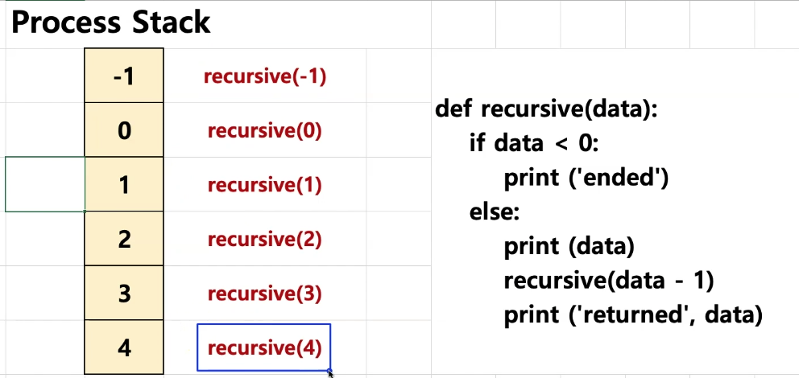

# 스택

* 데이터를 제한적으로 접근할 수 있는 구조
    + 한쪽 끝에서만 자료를 넣거나 뺄 수 있는 구조
* 가장 나중에 쌓은 데이터를 가장 먼저 빼낼 수 있는 구조

## 스택 구조

* 스택은 LIFO(last-in, first-out) 후입선출, FILO(first-in, last-out) 선입후출의 데이터 관리 방식을 따른다.
    + LIFO: 마지막에 넣은 데이터를 가장 먼저 추출하는 데이터 관리 정책
    + FILO: 처음에 넣은 데이터를 가장 마지막에 추출하는 데이터 관리 정책
* 대표적인 스택의 활용
    + 컴퓨터 내부의 프로세스 구조의 함수 동작 방식
* 주요기능
    + push: 데이터를 스택에 넣기
    + pop: 데이터를 스택에서 꺼내기
&nbsp;&nbsp;&nbsp;&nbsp;push&nbsp;&nbsp;&nbsp;&nbsp;&nbsp;&nbsp;&nbsp;&nbsp;&nbsp;&nbsp;&nbsp;&nbsp;&nbsp;&nbsp;&nbsp;pop  
 &nbsp;&nbsp;&nbsp;&nbsp;<- e &nbsp;&nbsp;&nbsp;&nbsp;&nbsp;&nbsp;&nbsp;&nbsp;&nbsp;&nbsp;&nbsp;&nbsp;&nbsp;&nbsp;&nbsp;&nbsp;-> e  
&nbsp;&nbsp;&nbsp;&nbsp;|a|&nbsp;&nbsp;&nbsp;&nbsp;&nbsp;&nbsp;|e|&nbsp;&nbsp;&nbsp;&nbsp;&nbsp;&nbsp;&nbsp;|a|  
&nbsp;&nbsp;&nbsp;&nbsp;|b|&nbsp;&nbsp;&nbsp;&nbsp;&nbsp;&nbsp;|a|&nbsp;&nbsp;&nbsp;&nbsp;&nbsp;&nbsp;&nbsp;|b|  
&nbsp;&nbsp;&nbsp;&nbsp;|c|&nbsp;&nbsp;&nbsp;&nbsp;&nbsp;&nbsp;|b|&nbsp;&nbsp;&nbsp;&nbsp;&nbsp;&nbsp;&nbsp;|c|  
&nbsp;&nbsp;&nbsp;&nbsp;|d|&nbsp;&nbsp;&nbsp;&nbsp;&nbsp;&nbsp;|c|&nbsp;&nbsp;&nbsp;&nbsp;&nbsp;&nbsp;&nbsp;|d|   
&nbsp;&nbsp;&nbsp;&nbsp;&nbsp;&nbsp;&nbsp;&nbsp;&nbsp;&nbsp;&nbsp;&nbsp;&nbsp;&nbsp;|d|  

## 스택 구조와 프로세스 스택

* 스택 구조는 프로세스 실행 구조의 가장 기본
    + 함수 호출시 프로세스 실행구조를 스택과 비교해서 이해가 필요

```python
# 재귀함수

## 데이터가 0보다 작으면 끝나고 아니면 recursive함수를 또 불러들여 계속 실행하는 것, 재귀함수
def recursive(data):
    if data < 0:
        print("ended")
    else:
        print(data)
        recursive(data-1)
        print("returned", data)
        
recursive(4)

# 결과값 <-- 프로세스가 ended된 뒤에 returned 된 숫자들의 순서대로 데이터가 삭제된다
4
3
2
1
0
ended
returned 0
returned 1
returned 2
returned 3
returned 4
```

## Process Stack



어떤 프로그램에서 프로그램이 실행되는 상태를 `Process`라고하는데,  
이 프로세스에는 `Process Stack`이라는 구조를 갖고 있게된다.  

그 구조, 프로세스에서 예를들어 위에서 만든 `recursive` 함수를 호출했을때  
그 함수가 호출됬다는 데이터를 저장하게된다.  

이 `Process Stack`의 구조는 재귀함수가 비슷하게 동작하기 때문에 재귀함수로 예를 들 수 있다.

위의 재귀함수를 보면 `recursive(4)`라는 함수를 호출하고 그 함수에서 또 `recursive(3)`이라는  
함수를 또 호출하게되는데, 호출했다는 정보를 `recursive(4)`를 호출했다는 정보위에 쌓게된다.  
이렇게 순차적으로 -1까지 호출하게된다.  
그렇게 `recursive(-1)`이 호출되면 이제 프로세스가 끝나게되고 쌓인 정보가 맨 마지막에 호출된 -1부터 사라져서 4까지 순차적으로 사라지게된다.

## 스택의 장단점

* 장점
    + 구조가 단순해서 구현이 쉽다.
    + 데이터 저장/읽기 속도가 빠르다

* 단점(일반적인 스택 구현시)
    + 데이터 최대 갯수를 미리 정해야한다.
        * 파이썬의 경우 재귀 함수는 1000번 호출이 가능하다.
    + 저장공간의 낭비가 발생할 수 있다.
        * 미리 최대 갯수 만큼 저장 공간을 확보해야한다
> 스택은 단순하고 빠른 성능을 위해 사용되므로, 보통 배열구조를 활용해서 구현하는 것이 일반적이다.

 ## 스택 구조를 직접 구현

 ```python
 # 리스트 변수로 스택을 다루는 push, pop 기능 구현해보기

data_stack2 = list()

def push(data):
    stack_list2.append(data)
    
def pop():
    # -1은 항상 리스트의 맨끝 데이터를 가져온다
    data = stack_list2[-1]
    del stack_list2[-1]
    return data
push(1)
push(2)
push(3)

print("push",stack_list2)

print("pop",pop())

# 결과값
push [1, 2, 3]
pop 3 # 마지막에 들어간 3이 먼저 추출된다
 ```

 