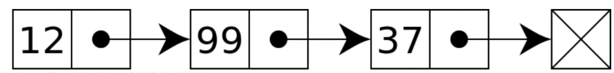
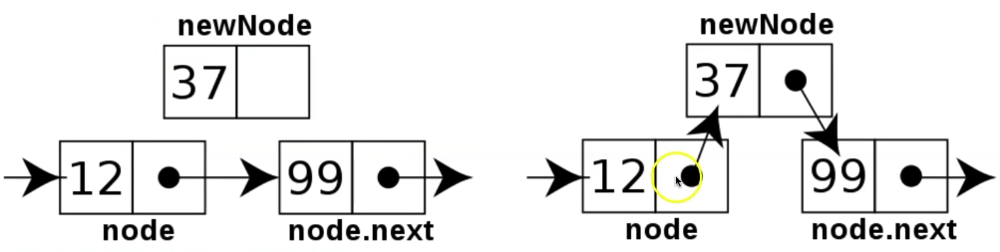

# 링크드리스트

- 연결 리스트라고 한다.
- 배열은 순차적으로 연결된 공간에 데이터를 나열하는 구조 <-- 예를들어 6개의 공간을 예약을 해놓고 데이터를 넣고 읽는구조로 공간낭비가 심하다
- 링크드 리스트는 떨어진 곳에 존재하는 데이터를 화살표로 연결해서 관리하는 데이터 구조 <--- 데이터 공간을 미리 잡아 놓을 필요가 없기 때문에 낭비가 줄어든다 
- 링크드 리스트는 미리 데이터 공간을 잡을 필요없이 필요할 때마다 추가할 수 있는 구조이다. 

## 링크드 리스트의 기본 구조와 용어

* 노드(Node): 데이터 저장 단위(데이터값, 포인터)로 구성
* 포인터(Pointer): 각 노드 안에서, 다음이나 이전의 노드와의 연결 정보를 가지고 있는 공간
  
### 일반적인 링크드 리스트의 형태

  

위의 이미지를 보면 데이터와 점으로 보이는 것이 있는데,  
링크드리스트는 배열처럼 하나의 데이터에 데이터 값만 저장하는 것이아닌  
링크드리스트 하나의 데이터에 위의 그림에서 보이는 것과 같이 왼쪽 셀에는 데이터 값과  
오른쪽셀에 점, 화살표로 표현한 다음 데이터의 주소값을 저장해 놓은 구조로 구성된 데이터를 노드라고 한다.  
&nbsp;  
그리고 주소값을 저장한다고 표현했는데 이것을 포인터라고한다.  
링크드리스트는 노드 단위로 아무 공간에나 저장을 해놓고 순서를 기억하기위해   
각 노드마다 다음 노드의 위치를 기억하는 주소(포인터)가 하나씩 붙어있는 형태를 링크드리스트 형태라고한다.  

## 링크드 리스트 노드 직접 구현하여 구성하기

```python
#객체지향 문법을 이용한 노드 구현
 
# 데이터와 주소를 저장할 공간이 필요하기 때문에 클래스를 사용
class Node:
    # init 함수를 이용하여 이 클래스가 만들어질때마다, 객체화 될때마다 데이터와 주소를 넣음
    # self는 생성된 객체(클래스)의 자신을 의미합니다.
    # 아래에 만든 init의 내용은 이 클래스 형태의 객체를 생성할때 self를 제외한 인자 2개를 줄 수 있는데
    # 만약 data하나를 준다면 연결된 주소값이 없는 데이터를 무작위 공간에 생성하는것이고
    # 만약 data와 next(다음 데이터로 연결되는 주소값)값을 넣어준다면 무작위 공간에 데이터를 만드는데 다른 데이터와 연결된 링크드 리스트가 만들어지는 것이다.
    def __init__(self, data, next=None):
        self.data = data
        self.next = next
        
# 노드와 노드 연결하기
node1 = Node(1)
node2 = Node(2)
# 현재 위의 node1과 node2는 연결되어있지 않기 때문에 연결시켜줘야한다
node1.next = node2
head = node1 # head라는 변수에는 맨 처음 시작점의 node를 가리킨다

print("head next",head.next.data) # 결과 2, 왜냐하면 node1의 next는 node2가되고 node2의 데이터는 2이기 때문이다

# 링크드 리스트로 데이터 추가하는법
def add(data):
    node = head
    # node.next만 넣으면 node.next가 있으면 while문을 실행한다는 의미이고 
    # 이렇게되면 node.next가 none일때 node의 값은 마지막 node의 값이 들어가게된다
    while node.next: 
        node = node.next
    # while문을 빠져나오면 마지막 node이고 그 node의 next 주소값에 새로 생성된 node를 넣어준다
    node.next = Node(data)
    
for i in range(8):
    add(i + 3)

while head.next:
    print('final linkedlist data',head.data)
    head = head.next

# 결과
head next 2
final linkedlist data 1
final linkedlist data 2
final linkedlist data 3
final linkedlist data 4
final linkedlist data 5
final linkedlist data 6
final linkedlist data 7
final linkedlist data 8
final linkedlist data 9
```

## 링크드 리스트의 장단점

* 장점
    + 미리 데이터 공간을 할당하지 않아도된다.
        * 배열은 미리 데이터 공간을 할당해야한다

* 단점
    + 연결을 위한 별도 데이터 공간이 필요하므로, 저장 공간 효율이 높지 않음 <-- 배열처럼 데이터 공간만있는 것이아니라 포인터(주소)값을 저장할 공간도 따로 마련해야되기 때문
    + 연결 정보를 찾는 시간이 필요하므로 접근 속도가 느리다. <-- 배열은 인덱스 번호로 바로 원하는 데이터에 접근 가능하지만 링크드리스트는 처음부터 검색해야됨.
    + 중간 데이터 삭제 시, 앞 뒤 데이터의 연결을 재구성해야되는 부가적인 작업이 필요하다 

## 링크드 리스트 데이터 사이에 데이터를 추가할 때

- 링크드 리스트는 유지 관리에 부가적인 구현이 필요하다
  

```python
# node3이라는 노드를 만들어 node1과 node2 사이에 넣기
node3 = Node(1.5)

search = True
node = node1

# node 1과 2사이에 넣을 것이기 때문에 첫번째 노드일때 search에 false를 넣어 while문을 중단시키고 
# 1이아니면 계속검색하여 node에 다음 노드를 넣어준다
while search:
    if node.data == 1:
        search = False
    # node.data가 1일 때까지 다음 노드를 검색한다
    else:
        node = node.next

# node_next에 node1의 다음 노드의 주소값을 넣어준다
node_next = node.next
print('node_nextdata', node_next.data)
# node1의 주소값에 새로 생성된 node3의 주소값을 넣어준다
node.next = node3 
#생성한 노드3의 주소값에 node_next값을 넣어 연결해준다
node3.next = node_next

while node.next:
    print('result',node.data)
    node = node.next
    

# 결과 <- 1과 2 사이에 1.5가 들어간것을 확인할 수 있다
node_nextdata 2
result 1
result 1.5
result 2
result 3
result 4
result 5
result 6
result 7
result 8
result 9
```