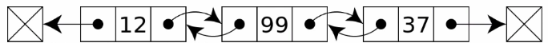

# 링크드리스트

- 연결 리스트라고 한다.
- 배열은 순차적으로 연결된 공간에 데이터를 나열하는 구조 <-- 예를들어 6개의 공간을 예약을 해놓고 데이터를 넣고 읽는구조로 공간낭비가 심하다
- 링크드 리스트는 떨어진 곳에 존재하는 데이터를 화살표로 연결해서 관리하는 데이터 구조 <--- 데이터 공간을 미리 잡아 놓을 필요가 없기 때문에 낭비가 줄어든다 
- 링크드 리스트는 미리 데이터 공간을 잡을 필요없이 필요할 때마다 추가할 수 있는 구조이다. 

## 링크드 리스트의 기본 구조와 용어

* 노드(Node): 데이터 저장 단위(데이터값, 포인터)로 구성
* 포인터(Pointer): 각 노드 안에서, 다음이나 이전의 노드와의 연결 정보를 가지고 있는 공간
  
### 일반적인 링크드 리스트의 형태

  

위의 이미지를 보면 데이터와 점으로 보이는 것이 있는데,  
링크드리스트는 배열처럼 하나의 데이터에 데이터 값만 저장하는 것이아닌  
링크드리스트 하나의 데이터에 위의 그림에서 보이는 것과 같이 왼쪽 셀에는 데이터 값과  
오른쪽셀에 점, 화살표로 표현한 다음 데이터의 주소값을 저장해 놓은 구조로 구성된 데이터를 노드라고 한다.  
&nbsp;  
그리고 주소값을 저장한다고 표현했는데 이것을 포인터라고한다.  
링크드리스트는 노드 단위로 아무 공간에나 저장을 해놓고 순서를 기억하기위해   
각 노드마다 다음 노드의 위치를 기억하는 주소(포인터)가 하나씩 붙어있는 형태를 링크드리스트 형태라고한다.  

## 링크드 리스트 노드 직접 구현하여 구성하기

```python
#객체지향 문법을 이용한 노드 구현
 
# 데이터와 주소를 저장할 공간이 필요하기 때문에 클래스를 사용
class Node:
    # init 함수를 이용하여 이 클래스가 만들어질때마다, 객체화 될때마다 데이터와 주소를 넣음
    # self는 생성된 객체(클래스)의 자신을 의미합니다.
    # 아래에 만든 init의 내용은 이 클래스 형태의 객체를 생성할때 self를 제외한 인자 2개를 줄 수 있는데
    # 만약 data하나를 준다면 연결된 주소값이 없는 데이터를 무작위 공간에 생성하는것이고
    # 만약 data와 next(다음 데이터로 연결되는 주소값)값을 넣어준다면 무작위 공간에 데이터를 만드는데 다른 데이터와 연결된 링크드 리스트가 만들어지는 것이다.
    def __init__(self, data, next=None):
        self.data = data
        self.next = next
        
# 노드와 노드 연결하기
node1 = Node(1)
node2 = Node(2)
# 현재 위의 node1과 node2는 연결되어있지 않기 때문에 연결시켜줘야한다
node1.next = node2
head = node1 # head라는 변수에는 맨 처음 시작점의 node를 가리킨다

print("head next",head.next.data) # 결과 2, 왜냐하면 node1의 next는 node2가되고 node2의 데이터는 2이기 때문이다

# 링크드 리스트로 데이터 추가하는법
def add(data):
    node = head
    # node.next만 넣으면 node.next가 있으면 while문을 실행한다는 의미이고 
    # 이렇게되면 node.next가 none일때 node의 값은 마지막 node의 값이 들어가게된다
    while node.next: 
        node = node.next
    # while문을 빠져나오면 마지막 node이고 그 node의 next 주소값에 새로 생성된 node를 넣어준다
    node.next = Node(data)
    
for i in range(8):
    add(i + 3)

while head.next:
    print('final linkedlist data',head.data)
    head = head.next

# 결과
head next 2
final linkedlist data 1
final linkedlist data 2
final linkedlist data 3
final linkedlist data 4
final linkedlist data 5
final linkedlist data 6
final linkedlist data 7
final linkedlist data 8
final linkedlist data 9
```

## 링크드 리스트의 장단점

* 장점
    + 미리 데이터 공간을 할당하지 않아도된다.
        * 배열은 미리 데이터 공간을 할당해야한다

* 단점
    + 연결을 위한 별도 데이터 공간이 필요하므로, 저장 공간 효율이 높지 않음 <-- 배열처럼 데이터 공간만있는 것이아니라 포인터(주소)값을 저장할 공간도 따로 마련해야되기 때문
    + 연결 정보를 찾는 시간이 필요하므로 접근 속도가 느리다. <-- 배열은 인덱스 번호로 바로 원하는 데이터에 접근 가능하지만 링크드리스트는 처음부터 검색해야됨.
    + 중간 데이터 삭제 시, 앞 뒤 데이터의 연결을 재구성해야되는 부가적인 작업이 필요하다 

## 링크드 리스트 데이터 사이에 데이터를 추가할 때

- 링크드 리스트는 유지 관리에 부가적인 구현이 필요하다
  

```python
# node3이라는 노드를 만들어 node1과 node2 사이에 넣기
node3 = Node(1.5)

search = True
node = node1

# node 1과 2사이에 넣을 것이기 때문에 첫번째 노드일때 search에 false를 넣어 while문을 중단시키고 
# 1이아니면 계속검색하여 node에 다음 노드를 넣어준다
while search:
    if node.data == 1:
        search = False
    # node.data가 1일 때까지 다음 노드를 검색한다
    else:
        node = node.next

# node_next에 node1의 다음 노드의 주소값을 넣어준다
node_next = node.next
print('node_nextdata', node_next.data)
# node1의 주소값에 새로 생성된 node3의 주소값을 넣어준다
node.next = node3 
#생성한 노드3의 주소값에 node_next값을 넣어 연결해준다
node3.next = node_next

while node.next:
    print('result',node.data)
    node = node.next
    

# 결과 <- 1과 2 사이에 1.5가 들어간것을 확인할 수 있다
node_nextdata 2
result 1
result 1.5
result 2
result 3
result 4
result 5
result 6
result 7
result 8
result 9
```

## 링크드 리스트를 객체지향 형태로 구현하여 데이터 추가, 검색, 삭제, 특정 노드 검색하는 로직 구현

```python
class Node:
    def __init__(self, data, next=None):
        self.data = data
        self.next = next

# 노드를 관리하는 클래스를 구성
class NodeMgmt:
    def __init__(self, data):
        # 관리할 노드의 헤드 값을 미리 저장하도록하는 구문
        self.head = Node(data)
    
    # 노드에 데이터를 넣음
    def add(self, data):
        # 만약 노드의 헤드값이 없는 경우 해당 노드의 데이터를 헤드값으로 넣는다 
        if self.head == '':
            self.head = Node(data)
        else:
            node = self.head
            # node의 next가 none이 되면 마지막 노드가 node 변수에 들어가있을 것이다
            while node.next:
                node = node.next
            # 마지막 노드의 next는 none일텐데 이때 새로운 노드를 생성하여 넣어주면 노드가 추가된다
            node.next = Node(data)
         
    # 노드의 전체 데이터를 검색
    def desc(self):
        node = self.head
        while node:
            print(node.data)
            node = node.next
    
    def delete(self, data):
        if self.head == '':
            print("해당 값을 가진 노드가 없습니다.")
            return
        # 헤드 데이터 삭제
        if self.head.data == data:
            temp = self.head
            # 헤드 노드의 주소를 다음 노드의 주소로 먼저 변경시켜준다.
            self.head = self.head.next
            del temp
        # 마지막 노드 삭제
        else:
            node = self.head
            while node.next:
                # 중간노드의 데이터 삭제
                if node.next.data == data:
                    temp = node.next
                    # 삭제할 노드의 다음 노드를 중간 노드의 주소값으로 변경
                    node.next = node.next.next
                    # 중간 노드 삭제
                    del temp
                else:
                    node = node.next
                    
    def search_node(self, data):
        node = self.head
        while node.next:
            if node.data == data:
                return node
            else:
                node = node.next
            
            
# 노드를 생성하고 검색해보자
linkedlist1 = NodeMgmt(0)

for i in range(1,10):
    linkedlist1.add(i)
    

linkedlist1.delete(0)

linkedlist1.delete(5)

linkedlist1.delete(9)

print('찾음',linkedlist1.search_node(4))

linkedlist1.desc()

# 결과

찾음 <__main__.Node object at 0x1027dd210>
1
2
3
4
6
7
8
```

## 다양한 링크드 리스트 구조

### 더블 링크드 리스트 구조
 
* 이중 연결 리스트라고함
* 장점: 양방향으로 연결되어있어서 노드 탐색이 양쪽으로 모두 가능


위의 이미지를 보면 한 노드에 데이터값과 이전노드와 다음노드의 주소값을 가지고 있다.  

```python
class Node:
    def __init__(self, data, prev=None ,next=None):
        self.data = data
        self.prev = prev
        self.next = next
        
class NodeMgmt:
    def __init__(self, data):
        # 노드를 처음 생성할 때 헤드를 설정해주는데, 이번엔 더블링크드리스트이기 때문에 
        # 끝부분부터 검색할 수 있도록 tail이 존재한다.
        self.head = Node(data)
        self.tail = self.head
        
    def insert(self,data):
        # self.head가 없다면 노드를 생성하고 head와 tail을 설정해준다
        if self.head == None:
            self.head = Node(data)
            # 처음에 노드를 생성하면 head나 tail이나 노드가 하나이기 때문에 
            # 아래와 같이 head를 tail에 넣어준다
            self.tail = self.head 
        else:
            # 헤드(노드)가 있다면, 
            node = self.head
            # 아래에 while문이 끝나면 마지막노드가 들어있을 것이다.
            while node.next:
                node = node.next
            # 새로 넣을 노드를 생성한다
            new = Node(data)
            # node.next(마지막노드의 다음주소)에 새로 생성한 노드의 주소값을 넣는다
            node.next = new
            # 그냥 링크드리스트와는 다르게 prev(이전 노드의 주소)에 마지막노드(node)의 주소값을 넣어준다
            new.prev = node
            # 마지막으로 현재 self의 tail은 마지막 노드 를 가리키고 있기 때문에 이를 새로생성된 노드의 주소로 교체해줘야한다
            self.tail = new
            
    def desc(self):
        node = self.head
        while node:
            print(node.data)
            node = node.next
            
    def search_from_head(self, data):
        if self.head == None:
            return False
            
        node = self.head
        while node:
            if node.data == data:
                return node
            else:
                node = node.next
        return false
    
    def search_from_tail(self, data):
        if self.tail == None:
            return False

        node = self.tail
        while node:
            if node.data == data:
                return node
            else:
                node = node.prev
        return false
    
    # 아래의 함수는 data라는 값을 가진 노드를 새로 생성하는데, before_data노드 앞에 만들겠다는 의미
    def insert_before(self, data, before_data):
        if self.head == None:
            self.head = Node(data)
            return True
        else:
            node = self.tail 
            # 마지막노드 tail에서부터 봤을때 목표 노드인 before_data 노드와 같지않다면 반복하라는 구문
            while node.data != before_data:
                # 노드의 이전 노드로 이동
                node = node.prev
                # 만약 before_data인 특정데이터를 가진 노드가 없다면 함수 종료 
                if node == None:
                    return False
            # 위의 반복문이 끝나면 before_data인 노드를 찾은것이고 data를 가진 새 노드를 생성
            new = Node(data)
            # 특정노드의 앞의 노드를 가리키게함
            before_new = node.prev
            # 특정노드 앞의 노드의 다음 노드의 주소는 새로 생성된 new 노드가됨
            before_new.next = new
            # 새로 생성된 노드의 이전 노드는 특정노드의 앞의 노드를 가리킨다
            new.prev = before_new
            # 새로 생성된 노드의 다음주소는 특정 노드를 가리킨다
            new.next = node
            # 특정노드의 이전노드는 새로 생성된 노드를 가리켜야한다
            node.prev = new
    
    def insert_after(self, data, after_data):
        if self.head == None:
            self.head = Node(data)
            return True
        else:
            node = self.head
            while node.data != after_data:
                node = node.next
                if node == None:
                    return False
            new = Node(data)
            after_new = node.next
            node.next = new
            new.next = after_new
            after_new.prev = new
            new.prev = node
            
doublelinkedlist = NodeMgmt(0)

for i in range(1,10):
    doublelinkedlist.insert(i)

doublelinkedlist.insert_before(1.5, 2)
doublelinkedlist.insert_after(3.5,3)
print('search_from_head=>',doublelinkedlist.search_from_head(3).data)
print('search_from_tail=>',doublelinkedlist.search_from_tail(3).data)
doublelinkedlist.desc()


# 결과
search_from_head=> 3
search_from_tail=> 3
0
1
1.5
2
3
3.5
4
5
6
7
8
9
```
