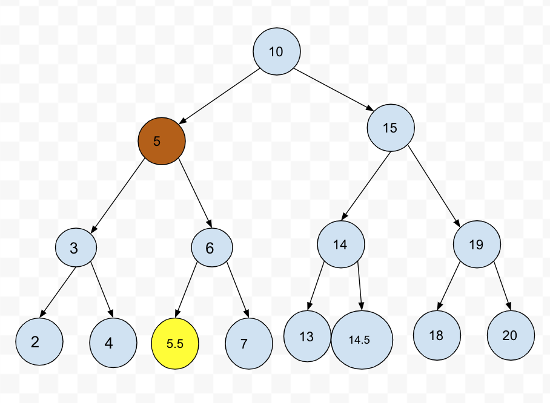
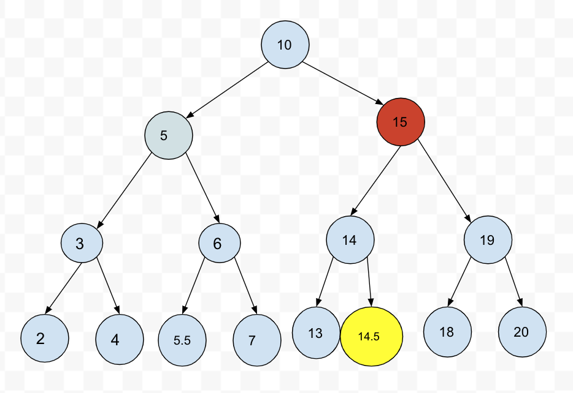

## 1. 트리 (Tree) 구조
- 트리: Node와 Branch를 이용해서, 사이클을 이루지 않도록 구성한 데이터 구조
- 실제로 어디에 많이 사용되나? 
  - 트리 중 이진 트리 (Binary Tree) 형태의 구조로, 탐색(검색) 알고리즘 구현을 위해 많이 사용됨

### 2. 알아둘 용어
- Node: 트리에서 데이터를 저장하는 기본 요소 (데이터와 다른 연결된 노드에 대한 `Branch` 정보 포함)
- Branch: 아래이미지를 보면 가지처럼 뻗어나가는 부분으로 데이터와 다른 노드를 연결시키는 부분을 브랜치라고한다
- Root Node: 트리 맨 위에 있는 노드
- Level: 최상위 노드를 Level 0으로 하였을 때, 하위 Branch로 연결된 노드의 깊이를 나타냄
- Parent Node: 어떤 노드의 다음 레벨에 연결된 노드
- Child Node: 어떤 노드의 상위 레벨에 연결된 노드
- Leaf Node (Terminal Node): Child Node가 하나도 없는 노드
- Sibling (Brother Node): 동일한 Parent Node를 가진 노드
- Depth: 트리에서 Node가 가질 수 있는 최대 Level


### 3. 이진 트리와 이진 탐색 트리 (Binary Search Tree)
- 이진 트리: 노드의 최대 Branch가 2인 트리
- 이진 탐색 트리 (Binary Search Tree, BST): 이진 트리에 다음과 같은 추가적인 조건이 있는 트리
  - 왼쪽 노드는 해당 노드보다 작은 값, 오른쪽 노드는 해당 노드보다 큰 값을 가지고 있음!

  

### 4. 자료 구조 이진 탐색 트리의 장점과 주요 용도
- 주요 용도: 데이터 검색(탐색) 
- 장점: 탐색 속도를 개선할 수 있음

> 단점은 이진 탐색 트리 알고리즘 이해 후에 살펴보기로 함

### 이진트리와 정렬된 배열간의 탐색 비교

  

### 5. 파이썬 객체지향 프로그래밍으로 링크드 리스트 구현하기

#### 5.1. 노드 클래스 만들기

```py
class Node:
    # 이진 탐색트리는 왼쪽, 오른쪽 최대 2개의 노드와 연결되기 때문에 아래와같이 left, right로 나눈다
    def __init__(self, value):
        self.value = value
        self.left = None
        self.right = None
```

#### 5.2. 이진 탐색 트리에 데이터 넣기

* 이진 탐색 트리 조건에 부합하게 데이터를 넣어야 함

```py
class NodeMgmt:
    # 트리를 처음 만들때 노드를 넣도록 constructor를 만드는데, 넣어준 노드가 루트노드가된다.
    def __init__(self, head):
        self.head = head
        
    # 값을 넣는 것
    def insert(self, value):
        # 노드를 순회해야되기때문에 루트 노드를 먼저 저장한다
        self.current_node = self.head
        # 트리에 넣을 값이 루트 노드의 값보다 작다면 왼쪽에 브랜치에 들어감
        while True:
            if value < self.current_node.value:
                # 루트 노드의 왼쪽 브랜치랑 연결된 노드가 있다면 current_node가 left 노드가 됨
                if self.current_node.left != None:
                    # 이렇게 current노드에 왼쪽 노드를 넣어주면 다시 while문이 돌면서 계속 순회하게됨
                    self.current_node = self.current_node.left
                else:
                    # 만약 루트 노드의 왼쪽 브랜치에 연결된 노드가 없다면 왼쪽 브랜치에 새 노드를 생성하고 while문을 멈춤
                    self.current_node.left = Node(value)
                    break
            else:
                # 만약 트리에 넣은값이 루트 노드의 값보다 크다면 오른쪽 브랜치에 들어감
                if self.current_node.right != None:
                    # 만약 루트 노드의 오른쪽 브랜치에 연결된 노드가 있다면 그 노드가 current 노드가 됨
                    self.current_node = self.current_node.right
                else:
                    # 루트 노드의 오른쪽 브랜치에 연결되 노드가 없다면 새로운 노드를 생성하여 넣어줌
                    self.current_node.right = Node(value)
                    break
    
head = Node(3)
BST = NodeMgmt(head)

BST.insert(2)
BST.insert(4)

```

#### 5.3. 이진 탐색 트리 탐색

```py
class Node:
    # 이진 탐색트리는 왼쪽, 오른쪽 최대 2개의 노드와 연결되기 때문에 아래와같이 left, right로 나눈다
    def __init__(self, value):
        self.value = value
        self.left = None
        self.right = None
        
class NodeMgmt:
    # 트리를 처음 만들때 노드를 넣도록 constructor를 만드는데, 넣어준 노드가 루트노드가된다.
    def __init__(self, head):
        self.head = head
        
    # 값을 넣는 것
    def insert(self, value):
        # 노드를 순회해야되기때문에 루트 노드를 먼저 저장한다
        self.current_node = self.head
        # 트리에 넣을 값이 루트 노드의 값보다 작다면 왼쪽에 브랜치에 들어감
        while True:
            if value < self.current_node.value:
                # 루트 노드의 왼쪽 브랜치랑 연결된 노드가 있다면 current_node가 left 노드가 됨
                if self.current_node.left != None:
                    # 이렇게 current노드에 왼쪽 노드를 넣어주면 다시 while문이 돌면서 계속 순회하게됨
                    self.current_node = self.current_node.left
                else:
                    # 만약 루트 노드의 왼쪽 브랜치에 연결된 노드가 없다면 왼쪽 브랜치에 새 노드를 생성하고 while문을 멈춤
                    self.current_node.left = Node(value)
                    break
            else:
                # 만약 트리에 넣은값이 루트 노드의 값보다 크다면 오른쪽 브랜치에 들어감
                if self.current_node.right != None:
                    # 만약 루트 노드의 오른쪽 브랜치에 연결된 노드가 있다면 그 노드가 current 노드가 됨
                    self.current_node = self.current_node.right
                else:
                    # 루트 노드의 오른쪽 브랜치에 연결되 노드가 없다면 새로운 노드를 생성하여 넣어줌
                    self.current_node.right = Node(value)
                    break
    
    # 검색했을때 해당값이 있으면 True를 반환
    def search(self, value):
        self.current_node = self.head
        # self.current_node가 None이 되면 while구문 종료
        while self.current_node:
            if self.current_node.value == value:
                return True
            # 검색할 값이 루트노드 값보다 작다면 current 노드에 왼쪽 노드를 넣어줌
            elif value < self.current_node.value: 
                self.current_node = self.current_node.left
            else:
                self.current_node = self.current_node.right
        # 여기까지 왔다는 것은 while문이 끝났다는 의미고 그 의미는 이진탐색트리에 그 값은 존재하지 않는다는 것
        # 따라서 반환되는 값은 False이다
        return False
    
head = Node(3)
BST = NodeMgmt(head)

BST.insert(2)
BST.insert(4)

print(BST.search(2), BST.search(4), BST.search(5))

True True False
```

#### 5.4. 이진 탐색 트리 삭제 
* 매우 복잡함. **경우를 나누어서 이해하는 것이 좋음**

#### 5.4.1. Leaf Node 삭제 
* Leaf Node(맨 마지막에 있는 노드): Child Node 가 없는 Node
* 삭제할 Node의 Parent Node가 삭제할 Node를 가리키지 않도록 한다. 
* 삭제할 노드를 삭제한 다음 그 부모 노드의 Branch를 None으로 만들어줘야한다 


#### 5.4.2. Child Node 가 하나인 Node 삭제 
* 삭제할 Node의 Parent Node가 삭제할 Node의 Child Node를 가리키도록 한다.
  


#### 5.4.3. Child Node 가 두 개인 Node 삭제
1. **삭제할 Node의 오른쪽 자식 중, 가장 작은 값을 삭제할 Node의 Parent Node가 가리키도록 한다.**
  
위의 이미지를 보면 갈색 동그라미 노드를 삭제한다고 했을때 해당 노드의  
오른쪽 노드의 가장 작은 값의 노드, 삭제노드의 오른쪽 노드 기준 맨 왼쪽의 노드(노란 동그라미)를  
삭제노드의 위치에 놓으면 이진탐색트리 규칙에도 벗어나지 않을 수 있다.
2. 삭제할 Node의 왼쪽 자식 중, 가장 큰 값을 삭제할 Node의 Parent Node가 가리키도록 한다.  
  
갈색 동그라미 노드를 삭제한다고 했을때 삭제할 노드 왼쪽 노드의 제일 큰 값(노란 동그라미)을  
삭제 노드의 위치에 놓는다
  


##### 5.4.3.1. 삭제할 Node의 오른쪽 자식중, 가장 작은 값을 삭제할 Node의 Parent Node가 가리키게 할 경우
- 삭제할 Node의 오른쪽 자식 선택
- 오른쪽 자식의 가장 왼쪽에 있는 Node를 선택
- 해당 Node를 삭제할 Node의 Parent Node의 왼쪽 Branch가 가리키게 함
- 해당 Node의 왼쪽 Branch가 삭제할 Node의 왼쪽 Child Node를 가리키게 함
- 해당 Node의 오른쪽 Branch가 삭제할 Node의 오른쪽 Child Node를 가리키게 함
- 만약 해당 Node가 오른쪽 Child Node를 가지고 있었을 경우에는, 해당 Node의 본래 Parent Node의 왼쪽 Branch가 해당 오른쪽 Child Node를 가리키게 함

### 5.5. 이진 탐색 트리 삭제 코드 구현과 분석

#### 5.5.1 삭제할 Node 탐색
- 삭제할 Node가 없는 경우도 처리해야 함
  - 이를 위해 삭제할 Node가 없는 경우는 False를 리턴하고, 함수를 종료 시킴

```py
    # 노드 삭제
    def delete(self, value):
        # 먼저 해당 값이 있는지 탐색부터 해야함. 왜냐하면 해당값이 없다면 노드를 삭제할 필요가 없기 때문
        # searched는 이 노드가 있다 없다를 판단할 기준이됨
        searched = False
        # current_node는 삭제할 노드 가리킴
        self.current_node = self.head
        # 삭제할 노드의 parent 노드를 가리킴
        self.parent_node = self.head
        
        while self.current_node:
            if self.current_node == value:
                searched = True
                break
            elif value < self.current_node:
                # 삭제할 값이 current 노드보다 작다면 왼쪽 브랜치이기 때문에 왼쪽 브랜치의 노드를 parent에 넣어줌
                self.parent_node = self.current_node
                # current 노드는 이제 왼쪽 브랜치의 노드로 이동하기 때문에 current 노드의 왼쪽 브랜치가됨
                self.current_node = self.current_node.left
            else:
                # 삭제할 값이 current 노드보다 크다면 오른쪽브랜치이기 때문에 오른쪽 브랜치의 노드를 parent에 넣어줌
                self.parent = self.parent_node
                self.current_node = self.current_node.right
                
        # 위의 while구문을 빠져나왔다면 삭제할값이 트리에 존재하지 않기 때문에 이 함수를 종료시켜야한다
        if searched == False:
            return False
        
        # 이후부터 Case 별로 분리해서 코드를 작성
```

#### 5.5.2. Case2: 삭제할 Node가 Child Node를 한 개 가지고 있을 경우
  

```py

        # Case별로 하기 이전에, 이미 위에서 삭제할노드가 있는지 확인하는 과정에서
        # self.current_node는 삭제할 노드를 가리키고 있을 것이고,
        # self.parent는 삭제할 노드(self.current_node)의 부모 노드를 가리키고 있다는 것을 생각하고 가야한다.
        
        # 노드가 leaf Node일 때, 삭제할노드의 왼쪽, 오른쪽 브랜치가 없는 경우가 된다.
        if self.current_node.left == None and self.current_node.right == None:
            # 삭제할값이 부모노드의 값보다 작다면 왼쪽 브랜치를 끊으면된다.
            if value < self.parent_node.value:
                self.parent.left = None
            else:
                self.parent.right = None
            # 마지막으로 해당 노드를 지운다
            del self.current_node
            
        # 삭제할 노드가 하나의 브랜치만 가지고 있는경우 - 삭제할 노드의 왼쪽 브랜치가 존재하는 경우(삭제할 값이 부모 노드값보다 작음)
        if self.current_node.left != None and self.current_ndoe.right == None:
            # 삭제할 노드의 부모노드 보다 값이 작다면
            if value < self.parent.value:
                # 삭제할노드의 부모노드의 왼 쪽 브랜치는 삭제할 노드의 자식 노드를 가리켜야됨
                self.parent.left = self.current_node.left
            else:
            # 삭제할 노드의 부모노드 보다 값이 크다면
                self.parent.right = self.current_node.left
        # 삭제할 노드가 하나의 브랜치만 가지고 있는경우 - 삭제할 노드의 오른쪽 브랜치가 존재하는 경우(삭제할 값이 부모 노드값보다 큰 경우)      
        elif self.current_node.left == None and self.current_node.right != None:
            if value < self.parent.value:
                # 삭제할 값이 부모 노드의 값보다 작기 때문에 왼쪽 브랜치에 삭제할 브랜치의 오른쪽 노드를 연결
                self.parent.left = self.current_node.right
            else:
                self.parent.right = self.current_node.right
```

#### 5.5.3. Case3-1: 삭제할 Node가 Child Node를 두 개 가지고 있을 경우 (삭제할 Node가 Parent Node 왼쪽에 있을 때)
* 기본 사용 가능 전략
  1. **삭제할 Node의 오른쪽 자식 중, 가장 작은 값을 삭제할 Node의 Parent Node가 가리키도록 한다.**
  2. 삭제할 Node의 왼쪽 자식 중, 가장 큰 값을 삭제할 Node의 Parent Node가 가리키도록 한다.
* 기본 사용 가능 전략 중, 1번 전략을 사용하여 코드를 구현하기로 함
  - 경우의 수가 또다시 두가지가 있음
    - **Case3-1-1:** 삭제할 Node가 Parent Node의 왼쪽에 있고, 삭제할 Node의 오른쪽 자식 중, 가장 작은 값을 가진 Node의 Child Node가 없을 때
    - **Case3-1-2:** 삭제할 Node가 Parent Node의 왼쪽에 있고, 삭제할 Node의 오른쪽 자식 중, 가장 작은 값을 가진 Node의 오른쪽에 Child Node가 있을 때
       - 가장 작은 값을 가진 Node의 Child Node가 왼쪽에 있을 경우는 없음, 왜냐하면 왼쪽 Node가 있다는 것은 해당 Node보다 더 작은 값을 가진 Node가 있다는 뜻이기 때문임

  

```py
    if self.current_node.left != None and self.current_node.right != None: # case3
        if value < self.parent.value: # case3-1
            self.change_node = self.current_node.right
            self.change_node_parent = self.current_node.right
            while self.change_node.left != None:
                self.change_node_parent = self.change_node
                self.change_node = self.change_node.left
            if self.change_node.right != None:
                self.change_node_parent.left = self.change_node.right
            else:
                self.change_node_parent.left = None
            self.parent.left = self.change_node
            self.change_node.right = self.current_node.right
            self.change_node.left = self.change_node.left
```

#### 5.5.4. Case3-2: 삭제할 Node가 Child Node를 두 개 가지고 있을 경우 (삭제할 Node가 Parent Node 오른쪽에 있을 때)
* 기본 사용 가능 전략
  1. **삭제할 Node의 오른쪽 자식 중, 가장 작은 값을 삭제할 Node의 Parent Node가 가리키도록 한다.**
  2. 삭제할 Node의 왼쪽 자식 중, 가장 큰 값을 삭제할 Node의 Parent Node가 가리키도록 한다.
* 기본 사용 가능 전략 중, 1번 전략을 사용하여 코드를 구현하기로 함
  - 경우의 수가 또다시 두가지가 있음
    - **Case3-2-1:** 삭제할 Node가 Parent Node의 오른쪽에 있고, 삭제할 Node의 오른쪽 자식 중, 가장 작은 값을 가진 Node의 Child Node가 없을 때
    - **Case3-2-2:** 삭제할 Node가 Parent Node의 오른쪽에 있고, 삭제할 Node의 오른쪽 자식 중, 가장 작은 값을 가진 Node의 오른쪽에 Child Node가 있을 때
       - 가장 작은 값을 가진 Node의 Child Node가 왼쪽에 있을 경우는 없음, 왜냐하면 왼쪽 Node가 있다는 것은 해당 Node보다 더 작은 값을 가진 Node가 있다는 뜻이기 때문임


```py
        else:
            self.change_node = self.current_node.right
            self.change_node_parent = self.current_node.right
            while self.change_node.left != None:
                self.change_node_parent = self.change_node
                self.change_node = self.change_node.left
            if self.change_node.right != None:
                self.change_node_parent.left = self.change_node.right
            else:
                self.change_node_parent.left = None
            self.parent.right = self.change_node
            self.change_node.left = self.current_node.left
            self.change_node.right = self.current_node.right
```

#### 5.5.5. 파이썬 전체 코드 구현

```py
class Node:
    def __init__(self, value):
        self.value = value
        self.left = None
        self.right = None

        
class NodeMgmt:
    def __init__(self, head):
        self.head = head
    
    def insert(self, value):
        self.current_node = self.head
        while True:
            if value < self.current_node.value:
                if self.current_node.left != None:
                    self.current_node = self.current_node.left
                else:
                    self.current_node.left = Node(value)
                    break
            else:
                if self.current_node.right != None:
                    self.current_node = self.current_node.right
                else:
                    self.current_node.right = Node(value)
                    break
    
    def search(self, value):
        self.current_node = self.head
        while self.current_node:
            if self.current_node.value == value:
                return True
            elif value < self.current_node.value:
                self.current_node = self.current_node.left
            else:
                self.current_node = self.current_node.right
        return False        
    
    def delete(self, value):
        # 삭제할 노드 탐색
        searched = False
        self.current_node = self.head
        self.parent = self.head
        while self.current_node:
            if self.current_node.value == value:
                searched = True
                break
            elif value < self.current_node.value:
                self.parent = self.current_node
                self.current_node = self.current_node.left
            else:
                self.parent = self.current_node
                self.current_node = self.current_node.right

        if searched == False:
            return False    

        # case1
        if  self.current_node.left == None and self.current_node.right == None:
            if value < self.parent.value:
                self.parent.left = None
            else:
                self.parent.right = None
        
        # case2
        elif self.current_node.left != None and self.current_node.right == None:
            if value < self.parent.value:
                self.parent.left = self.current_node.left
            else:
                self.parent.right = self.current_node.left
        elif self.current_node.left == None and self.current_node.right != None:
            if value < self.parent.value:
                self.parent.left = self.current_node.right
            else:
                self.parent.right = self.current_node.right        
        
        # case 3
        elif self.current_node.left != None and self.current_node.right != None:
            # case3-1
            if value < self.parent.value:
                self.change_node = self.current_node.right
                self.change_node_parent = self.current_node.right
                while self.change_node.left != None:
                    self.change_node_parent = self.change_node
                    self.change_node = self.change_node.left
                if self.change_node.right != None:
                    self.change_node_parent.left = self.change_node.right
                else:
                    self.change_node_parent.left = None
                self.parent.left = self.change_node
                self.change_node.right = self.current_node.right
                self.change_node.left = self.change_node.left
            # case 3-2
            else:
                self.change_node = self.current_node.right
                self.change_node_parent = self.current_node.right
                while self.change_node.left != None:
                    self.change_node_parent = self.change_node
                    self.change_node = self.change_node.left
                if self.change_node.right != None:
                    self.change_node_parent.left = self.change_node.right
                else:
                    self.change_node_parent.left = None
                self.parent.right = self.change_node
                self.change_node.right = self.current_node.right
                self.change_node.left = self.current_node.left

        return True
```

#### 5.5.6. 파이썬 전체 코드 테스트
- random 라이브러리 활용
  - random.randint(첫번째 숫자, 마지막 숫자): 첫번째 숫자부터 마지막 숫자 사이에 있는 숫자를 랜덤하게 선택해서 리턴
    - 예: random.randint(0, 99): 0에서 99까지 숫자중 특정 숫자를 랜덤하게 선택해서 리턴해줌

```py
# 0 ~ 999 숫자 중에서 임의로 100개를 추출해서, 이진 탐색 트리에 입력, 검색, 삭제
import random

# 0 ~ 999 중, 100 개의 숫자 랜덤 선택
bst_nums = set()
while len(bst_nums) != 100:
    bst_nums.add(random.randint(0, 999))
# print (bst_nums)

# 선택된 100개의 숫자를 이진 탐색 트리에 입력, 임의로 루트노드는 500을 넣기로 함
head = Node(500)
binary_tree = NodeMgmt(head)
for num in bst_nums:
    binary_tree.insert(num)
    
# 입력한 100개의 숫자 검색 (검색 기능 확인)
for num in bst_nums:
    if binary_tree.search(num) == False:
        print ('search failed', num)

# 입력한 100개의 숫자 중 10개의 숫자를 랜덤 선택
delete_nums = set()
bst_nums = list(bst_nums)
while len(delete_nums) != 10:
    delete_nums.add(bst_nums[random.randint(0, 99)])

# 선택한 10개의 숫자를 삭제 (삭제 기능 확인)
for del_num in delete_nums:
    if binary_tree.delete(del_num) == False:
        print('delete failed', del_num)
```

### 6. 이진 탐색 트리의 시간 복잡도와 단점
#### 6.1. 시간 복잡도 (탐색시)
  - depth (트리의 높이) 를 h라고 표기한다면, O(h)
  - n개의 노드를 가진다면, $h = log_2{n} $ 에 가까우므로, 시간 복잡도는 $ O(log{n}) $ 
     - 참고: 빅오 표기법에서 $log{n}$ 에서의 log의 밑은 10이 아니라, 2입니다.
       - 한번 실행시마다, 50%의 실행할 수도 있는 명령을 제거한다는 의미. 즉 50%의 실행시간을 단축시킬 수 있다는 것을 의미함


#### 6.2. 이진 탐색 트리 단점
  - 평균 시간 복잡도는 $ O(log{n}) $ 이지만, 
    - 이는 트리가 균형잡혀 있을 때의 평균 시간복잡도이며,
  - 다음 예와 같이 구성되어 있을 경우, 최악의 경우는 링크드 리스트등과 동일한 성능을 보여줌 ( $O(n)$ )


