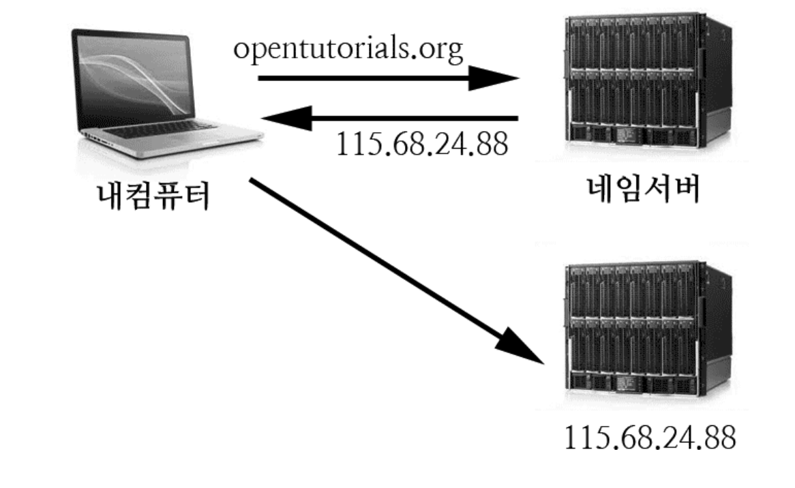

## IP란?

인터넷에 연결되어 있는 장치(컴퓨터, 스마트폰, 타블릿, 서버 등등)들은  
각각의 장치를 식별할 수 있는 주소를 가지고 있는데 이를 ip라고 합니다.  
예) 115.68.24.88, 192.168.0.1

### IP의 특징

하나의 IP는 네트워크 부분 + 호스트 부분으로 구성되어 있습니다.  
하나의 네트워크 즉 하나의 브로드캐스트 도메인에 있는 IP끼리 통신하기 위해선  
네트워크 영역이 같아야하며, 호스트 IP는 달라야합니다.  
&nbsp;  
호스트 IP가 다르지 않다면 IP 충돌이 나겠죠?  
당연히 통신하기 위해선 네트워크 영역이 같아야 합니다.  
&nbsp;  
그런데 잠깐! 네트워크 영역이 다르다고 해서 통신할 수 없을까요? 아닙니다.  
네트워크 영역이 달라도 라우터나 게이트웨이와 같은 통신장비를 통해 통신할 수 있습니다!.  
&nbsp;  
다만 라우터와 네트워크장비 없이 통신할 수 있는 영역을 우리는 브로드캐스트 도메인이라고 하고  
하나의 네티워크 영역에는 당연히 네트워크 영역은 같고, 호스트 IP는 자신의 노드를  
식별할 수 있도록 다른 호스트 IP와 달라야 하겠죠?  
&nbsp;  
호스트 IP는 마치 주민번호와 같은겁니다.  
중복할 될 수 없는 유일무이한 것이지요..
&nbsp;  
예를 들어 192.168.0.3 과 192.168.0.4 를 보면 192.168.0 은  
네트워크 영역이고 3과 4는 호스트 IP입니다.  
&nbsp;  
이를 해석하면 192.168.0 이라는 네트워크 영역에서 서로 통신할 수 있는  
3과 4가 존재한다고 보면 됩니다.

## 도메인(domain)이란?

ip는 사람이 이해하고 기억하기 어렵기 때문에 이를 위해서 각 ip에  
이름을 부여할 수 있게 했는데, 이것을 도메인이라고 합니다.

- opentutorials.org -> 115.68.24.88
- naver.com -> 220.95.233.172
- daum.net -> 114.108.157.19

### 도메인의 구성요소

도메인은 컴퓨터의 이름과 최상위 도메인으로 구성되어 있습니다.

- opentutorials.org
  + opentutorials : 컴퓨터의 이름
  + org : 최상위 도메인 - 비영리단체

- daum.co.kr
  + daum : 컴퓨터의 이름
  + co : 국가 형태의 최상위 도메인을 의미
  + kr : 대한민국의 NIC에서 관리하는 도메인을 의미

#### 최상위 도메인이란?

  

DNS (Domain Name System)에는 이름의 계층 구조가 있습니다.  
TLD (최상위 도메인)는 COM, NET, ORG, EDU, INFO, BIZ, CO.UK 등 계층 구조의 일반 이름 집합입니다.

### URL의 이해

- 도메인은 장치를 식별하기 위한 주소입니다.
- URL은 도메인 + 경로
- 예를 들어서 https://s3.ap-northeast-2.amazonaws.com/opentutorials-user-file/module/121/298.png가 있을 때
    + 도메인 : opentutorials.org
    + URL : https://s3.ap-northeast-2.amazonaws.com/opentutorials-user-file/module/121/298.png

## 네임서버(DNS)란?

사이트 접속을 하기 위해선, 해당 사이트에 대한 정보를 갖고 있는 서버의 주소 . 즉 IP를 알아야 합니다.  
예를 들어 고도호스팅 사이트에 접속하기 위해선 고도호스팅 사이트 정보를 담고 있는 서버의 IP(주소)를 알아내야 합니다. 하지만 사이트가 한 두개라면 모를까. 지금도 전세계적으로 무수히 많은 도메인에 연결된 IP를 알아내기란 쉽지 않습니다. 그래서 등장한 것이 바로 DNS(Domain Name Service)서버 입니다. 

## VPC란?

VPC는 프라이빗 클라우드를 만드는 데 가장 기본이 되는 리소스입니다.  
&nbsp;  
VPC는 논리적인 독립 네트워크를 구성하는 리소스로 이름과 IPv4 CIDR 블록을 필수적으로 가집니다.  
&nbsp;  
CIDR 블록은 IP의 범위를 지정하는 방식입니다.  
&nbsp;  
CIDR 블록은 IP 주소와 슬래시(/) 뒤에 따라오는 넷마스크 숫자로 구성되어있습니다.  
&nbsp;  
이 숫자는 IP 범위를 나타냅니다. 이 숫자가 32이면 앞에 기술된 IP 정확히 하나를 가리킵니다.  
&nbsp;  
예를 들어 192.168.0.0/32는 192.168.0.0을 가리킵니다.  
범위는 지정된 IP부터 2^(32-n)개가 됩니다.  
예를 들어 뒤의 숫자가 24라면, 2^(32-24)=256개의 IP 주소를 의미합니다.  
&nbsp;  
예를 들어 192.168.0.0/24는 192.168.0.0에서  
192.168.1.255까지의 IP를 의미합니다.

## 서브네팅이란? (Subnetting)

서브네팅은 "네트워크 관리자가 네트워크 성능을 향상시키기 위해, 자원을 효율적으로 분배하는 것입니다.  
&nbsp;  
여기서 자원을 효율적으로 분배한다는 것은 네트워크 영역과 호스트 영역을 분할 하는 것이라고 생각하면 됩니다."  
&nbsp;  
네트워크적인 측면에서 말하자면, 너무 큰 브로드캐스트 도메인은 네트워크 환경에서  
패킷전송을 느리게하고 성능저하를 발생시킵니다.  
&nbsp;  
따라서 네트워크를 쪼개서 통신 성능을 보장하는 것입니다.  
&nbsp;  
또한 IP는 32자리 2진수로 표현할 수 있는데 이 말은 결국 최대 2의 32승만큼의 표현만 가능하다는 뜻 입니다.  
&nbsp;  
즉, 자원의 한계가 존재한다는 뜻이고 결국 제한적인 자원으로 인해 주소에 낭비 없이 아껴써야 합니다.  
&nbsp;  
그래서 등장하는 것이 서브넷마스크라는 녀석입니다.  
&nbsp;  
서브넷 마스크는 필요한 네트워크 주소만 호스트 IP로 할당 할 수 있게 만들어 네트워크 낭비를 방지합니다.  
&nbsp;  
이를 전문용어로 서브네팅이라 하며 그 반대는 슈퍼네팅이라고 합니다.  

## 웹호스팅이란

홈페이지를 운영하기 위해서는 서버 장비, 인터넷 회선 그리고 서버를 1년 365일  
가동할 수 있는 최적의 환경을 갖춘 전산실과 서버를 관리할 엔지니어가 필요합니다.  
일반적으로 웹(WWW) 공간을 임대(hosting)하는 것을 웹호스팅이라고 합니다.

