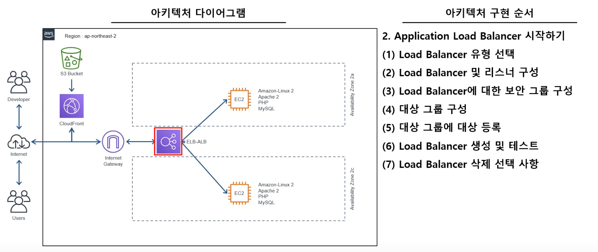

## EC2-LAMP-ELB 구성하는 순서
  
  

## EC2의 사용법

1. aws 페이지의 `Services`에서 `EC2`를 찾아 들어갑니다.
2. 왼쪽 메뉴바에서 `Instances`를 들어가면 내가 빌린 가상 컴퓨터(Instance)의 리스트가 나옵니다.
3. `Launch Instance`를 눌러 인스턴스 생성화면으로 갑니다.
4. Linux를 사용하기위해 `Amazon Linux`를 선택합니다 (free tier eligible 피켓 있는 걸로 선택)
5. 마찬가지로 `Free tier eligible` 피켓이 있는 사양의 인스턴스를 선택하여 `Next: Configure instance details`를 눌러 이동합니다.
6. `Number of Instance`는 몇개의 인스턴스를 생성할지 정하는 것이고, `Subnet`은 EC2 인스턴스가 어디로 배치될지 설정하는 것인데 `north east-2a`로 설정합니다. `Auto-assign Public IP`는 자동으로 공인아이피를 설정하게할지 정하는 것인데 `Enable`로 설정합니다. 그 외의 것들을 Default로 설정된 값들을 넣습니다. 그리고 맨 아래의 `User data`에는 `#include https://bit.ly/Userdata`라는 값을 넣고 `Next Add Storage`를 클릭합니다.
7. `EC2`의 `Size`는 8기가 그대로 놓고 `Next: Add Tags`로 이동합니다.
8. `Add Tags`는 이 EC2 인스턴스가 어떤용도로 쓰이는지 꼬리표를 붙이는 용도입니다. `Add Tag`를 눌러 `key`에는 `Name`을 넣고 `Value`에는 연구용이고 웹서버용으로 사용하며 public한 상태로 2a에서 사용할 것이기 때문에 `lab-web-pub-2a`라는 내용을 넣어줍니다. `Next Configure Security Group`을 누릅니다.
9. `Configure Security Group`은 AWS가 기본적으로 제공해주는 방화벽입니다. 기존에 만든 방화벽이 없기 때문에 `Create a new security group`을 선택하고 `Security group name`에는 `lab-web-sg`라고 입력합니다. 밑에 `Rule`은 기본적으로 리눅스이기 때문에 `SSH`가 들어가있고 웹서버 테스트를 위한 `HTTP` 룰이 추가해야합니다. `Add Rule`을 클릭하고 타입에서 `HTTP`를 선택합니다. 그리고 `source` 부분은 `0.0.0.0/0`으로 수정합니다. `Review and Lunch`를 누릅니다.
10. `Review Instance Launch`는 여태까지 설정한 내용들을 보여줍니다. `Launch`를 누릅니다.
11. 그러면 `key pair`관련 모달이 뜨게되는데, EC2는 암호화된 `key pair`로 리눅스 OS와 통신하게됩니다. 은행 공인인증서과 같은 원리라고 생각하면됩니다. `create new key pair`을 선택하고 `key pair name`은 서울 리전에 웹서버 연구용이라는 의미로 `seoul-lab-web`를 넣고 `Download Key Pair`을 누릅니다. 그러면 `seoul-lab-web.pem`이라는 파일이 다운로드됩니다. `Launch Instance`를 누릅니다.
12. `View Instance`를 누릅니다.
13. 생성된 인스턴스를 확인할 수 있고 status가 `Running`이 되면 인스턴스가 작동하고 있는 것입니다.
14. 이제 인스턴스(원격 컴퓨터)에 접속을해야되는데, 맥의 경우는 해당 인스턴스를 오른쪽으로 클릭하고 `Connect`를 선택해서 연결하면 들어가집니다.

## AMI(Amazon Machine Image)를 이용한 EC2 생성

아마존 머신 이미지는 인스턴스 생성에 필요한 모든 소프트웨어의 정보를 담고 있는 템플릿 이미지입니다.  

### 생성방법

1. `Action`을 누르고 `Image`의 `create Image`를 선택합니다.
2. `Image Name`과 `Imgae Description`에 `lab-web-현재날짜`를 적습니다. 이후 `No reboot`이라는 것이 있는데 AMI를 생성할 때 EC2 인스턴스를 재부팅하지 않고 생성하는 옵션입니다. EC2 인스턴스를 재부팅하지 않고 AMI를 생성하면 파일시스템의 무결성을 보장하지 않습니다. `No reboot` 옵션을 선택하면 멈춰 있는 인스턴스에서 AMI를 생성합니다. `Create Image`를 클릭합니다. 
3. 왼쪽 메뉴중 `AMIs`에서 생성 중인지 확인할 수 있습니다.
4. 이제 AMI를 이용하여 인스턴스를 만들어볼 겁니다. `AMIs`에서 방금 생성한 것을 선택하고 `Launch`를 클릭합니다.
5. `free tire` 리눅스 인스턴스를 선택하고 다음으로 넘어갑니다.
6. 서브넷은 `north east-2c`로 선택하고 맨밑에 `Userdata`는 안넣어줘도됩니다. 왜냐하면 이정보는 이미 AMI에서 담고 있기 때문입니다. 다음으로 넘어가고 `add Tag`로 넘어갑니다.
7. 태그를 추가하는데 Name에 이번에는 `lab-web-pub-2c`로 태그를 추가합니다. 다음으로 넘어갑니다.
8. 우리는 기존에 생성한 방화벽 세팅이 있기 때문에 `Select an existing security group`을 선택하여 `lab-web-sg`를 선택하고 `Review and Launch`를 클릭하고 내용확인 후에 `Launch`합니다.
9. 우리는 기존의 `key pair`을 사용할 것이기 때문에 `seoul-lab-web`을 선택하고 체크박스를 체크하고 `Launch Instane`를 클릭합니다.
10. 생성된 인스턴스의 `Public IPv4 address`를 복사하여 주소창에 붙여넣고 접속하면 정상적으로 인스턴스가 실행되었는지 확인할 수 있습니다.

## Application Load Balancer를 통한 네트워크 이중화 구성

### Load Balancer가 왜 필요한가?

유저가 한두명인 경우는 서버가 응답할 때 문제가 없지만 만약 유저  
수천만명이 접속하게된다면 서버에 부하가 걸려 동작이 멈추게됩니다.  
&nbsp;  
이를 위해 두가지 문제 해결방법이 있는데,  
첫번째는 `Scale-up` : Server가 더 빠르게 동작하기 위해 하드웨어 성능을 올리는 방법이 있습니다.  
두번째는 `Scale-out` : 하나의 Server 보다는 여러 대의 Server가 나눠서 일을 하는 방법이 있습니다.  
&nbsp;  
여기서 `Scale-up`을 하는 비용은 상당히 비싸기 때문에 `Scale-out` 방법을 이용합니다.  
이는 여러 대의 Server 덕분에 무중단 서비스를 제공할 수 있습니다.  
&nbsp;  
이때 여러 대의 Server에게 균등하게 Traffic을 분산시켜주는 역할을 하는 것이 `Load Balancer`입니다.  

### Load Balancing이란?

하나의 인터넷 서비스가 발생하는 트래픽이 많을 때 여러 대의 서버가 분산처리하여  
서버의 로드율 증가, 부하량, 속도저하 등을 고려하여 적절히 분산처리하여 해결해주는 서비스입니다.  

### 설정 방법

1. EC2 왼쪽 메뉴의 맨아래로 가보면 `Load Balancers`가 있습니다.
2. `Create Load Balancer`를 누릅니다.
3. 3개가 나오는데 우리는 `Application Load Balancer`를 사용할 것입니다. `Create`를 누릅니다.
4. `Configure Load Balancer`에서 `name`은 `lab-web-alb`라고 입력하고 `Schema`에서는 `internet-facing` 인터넷 용으로 사용할 것인가 아니면 `internal` 인터넷과 연결되지 않는 내부 용으로 사용할 것인가 선택하는 것인데 인터넷 용으로 선택합니다. `Listeners`는 `Application Load Balancer`가 통과할 포트 번호를 설정하는데 기본값으로 놔둡니다. 만약 다른 포트가 있다면 추가하면됩니다. `Availability Zones`는 로드밸런서를 사용할 서브넷을 지정하는데, 2a와 2c를 선택하고 `Tag`에는 `Name`에 `lab-web-alb`로 입력하고 다음으로 넘어가고 또 다음으로 넘어갑니다.
5. 그러면 `Configure Security Groups`가 나오는데, 기존에는 웹용 security group이었기 때문에 `Application Load Balancer`용 security group을 생성할 것입니다. `lab-web-alb-sg`라는 이름의 security group을 생성할 것이고 `Source`부분만 `0.0.0.0/0`로 수정하고 다음으로 넘어갑니다.
6. `Configure Routing`은 어느 ec2를 등록하겠냐는 타겟 그룹을 선택하게되는데, 기존에 만든것이 없다면 `New target group`을 선택하고 `lab-web-alb-tg`로 입력하고 나머지는 기본값으로 놔두고 다음으로 넘어갑니다.  
7. `Register Targets`은 방금 생성한 ec2를 생성할 `Application Load Balancer`의 타겟 그룹으로 지정하겠다고 설정하는 곳입니다. 생성한 두개의 인스턴스를 선택하고 `Add to register`를 누르면 등록되게됩니다. 다음으로 넘어가면 지금까지 정의한 내용을 확인할 수 있습니다. Create하면 생성이되게됩니다.
8. 리스트의 로드밸런서를 클릭하면 아래의 `Basic Configuration`이 보이는데, 여기서 중요한 것은 `DNS name`입니다. 인터넷에서는 ec2로 바로 접근해서 웹페이지를 보는것이 아닌 `Application Load Balancer`의 `DNS name`을 브라우저에 입력해서 생성한 두개의 ec2의 웹화면을 보게되는 것입니다. 
9. `DNS name`을 복사하여 주소창에 붙여넣고 접속하면 2a 인스턴스의 페이지가 나옵니다. 우리는 인스턴스 2개를 설정했기 때문에 새로고침하면 2c 인스턴스가 나오게 될겁니다. 이렇게되면 Application Load Balancer를 통한 네트워크 이중화 구성이 완료된 것입니다.

