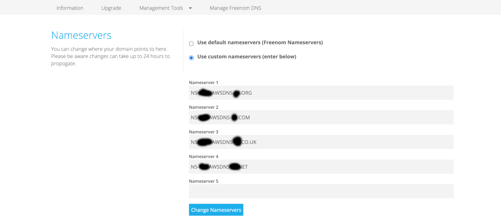
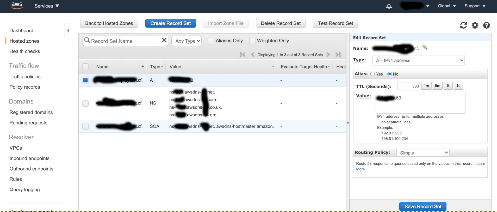

## AWS Route 53

Amazon Route 53는 가용성과 확장성이 뛰어난 클라우드 Domain Name System (DNS) 웹 서비스입니다.  
&nbsp;  
이 서비스에서는 `www.example.com`과 같은 도메인 이름을 `192.0.2.1`과 같은 IP 주소로 변환합니다.  
&nbsp;  
Amazon Route 53는 사용자의 요청을 Amazon EC2 인스턴스, Elastic Load Balancing 로드 밸런서,  
Amazon S3 버킷 등 AWS에서 실행되는 인프라에 효과적으로 연결합니다.  
&nbsp;  
사용자를 AWS 외부의 인프라로 라우팅하는 데도 Route 53를 사용할 수 있습니다.  
Amazon Route 53를 사용하여 트래픽을 정상적인 엔드포인트로 라우팅하거나 애플리케이션 및  
해당 엔드포인트의 상태를 개별적으로 모니터링하도록 DNS 상태 확인을 구성할 수 있습니다.  
&nbsp;  
Amazon Route 53에서는 도메인 이름 등록도 지원합니다.  
사용자는 `example.com`과 같은 도메인 이름을 구매하여 관리할 수 있으며  
Amazon Route 53에서 도메인에 대한 DNS 설정을 자동으로 구성하게 됩니다.  
&nbsp;  
이제 외부의 무료 도메인 사이트을 이용하여 Route 53에 이전하고 ELB를 연결해보겠습니다.  

## 도메인 설정 하는법

1. https://www.freenom.com/ 에 접속합니다.  
우측 상단에 있는 [Sign in]을 클릭합니다.  
무료 도메인 사이트는 이 외에도 많이 존재하니 다른 곳을 이용하셔도 등록방법은 일맥상통합니다.
2. 구글이나 페이스북으로 소셜 sign in이 가능합니다. 여기서는 구글로 진행하겠습니다.
3. 로그인이 되었습니다.  
[Services] -> [Register a New Domain]을 클릭합니다.
4. 사용하고 싶은 도메인 이름을 Check 해봅니다.  
여기서는 ‘testfreedomain’이라는 도메인 이름에 최상위 도메인을 .ml로 선택하였습니다.  
‘Free’라는 태그가 붙은 도메인은 무료이므로 사용하고 싶은 것을 고르면 됩니다.  
[Get it now!]를 클릭합니다.  
버튼이 [Selected]로 바뀌면 발급이 완료된 것입니다.
5. 상단에 [Checkout]을 클릭합니다.
6. Period 에서 무료로 사용할 수 있는 기간을 선택할 수 있습니다.  
여기서는 3개월을 선택하겠습니다. [Continue]를 클릭합니다.
7. Review & Checkout 에서 발급받은 도메인과 가격을 확인할 수 있습니다.  
무료 도메인을 선택했으니 요금은 $0.00USD입니다.  
Your Details에는 Country를 South Korea로 선택합니다.  
하단의 정책조건에 동의하는 체크 박스에 체크하고 [Complete Order]를 클릭합니다.
8. Order Number 를 알려줍니다.  
[Click here to go to your Client Area]를 클릭합니다.
9. 상단의 [Services] -> [My Domains]를 클릭하면 위와 같이 구매한 도메인을 확인할 수 있습니다.  
해당 도메인의 `Management Domain`을 누르고 `Management Tool`을 누르고 `NameServer`를 누르면  
네임서버를 적는 구간이 있습니다. 그곳에 `Route 53`에서 생성한 `Hosted Zone`을 선택하여 `Type`이 `NS`인 `Value`에 있는 4개의 주소를 적어주면됩니다.  

10. 이제 AWS 콘솔로 넘어가겠습니다.  
Route 53 콘솔로 들어가 [Hosted zones] -> [Create Hosted Zone]을 클릭합니다.
11. Domain Name에 이전에 발급받은 도메인을 기입합니다. 여기서는 ‘testfreedomain.ml’을 사용하겠습니다.  
[Create]를 클릭합니다.
12. NS 타입과 SOA 타입의 레코드 셋이 생성되어 있는 것을 확인할 수 있습니다.  
NS는 네임 서버 레코드, SOA는 권한 시작 레코드입니다.  
[Create Record Set]을 클릭합니다.
13. Name 에는 하위 도메인을 설정할 수 있습니다.  
여기서는 일반적으로 쓰이는 www를 사용하겠습니다.  
`Type`은 `A` 레코드, `Alias`는 `No`에 체크하고 `Value`에다가 배포한 인스턴스의 `Public IPv4 address`를 입력해주면 됩니다.  
설정을 마쳤으면 [Create]를 클릭합니다.
  
14. Record Set에 방금 생성한 A 레코드의 도메인을 확인할 수 있습니다.  
하지만 여기서 끝난 것이 아닙니다. 네임서버를 이전에 발급받은 무료 도메인에 적용해 주어야 합니다.
15. freenom 사이트의 My Domains에서 구매한 도메인의 [Manage Domain]을 클릭합니다.
16. [Management Tools] -> [Nameservers] 를 클릭한 다음,  
Use custom nameservers (enter below)를 체크하고 Route 53 NS 레코드의 Value 값을 넣어줍니다.  
전부 입력하고 [Change Nameservers]를 클릭합니다.
17. 등록한 도메인을 브라우저 주소창에 입력하면  
위와 같이 이전에 생성했던 index.html이 출력되는 것을 확인할 수 있습니다.  
만약 연결되지 않고 ERR_NAME_NOT_RESORVED가 표시된다면 브라우저의 쿠키를 제거하거나  
관리자 권한으로 cmd에 접근하여 dns를 flush 및 register 해보시기 바랍니다.