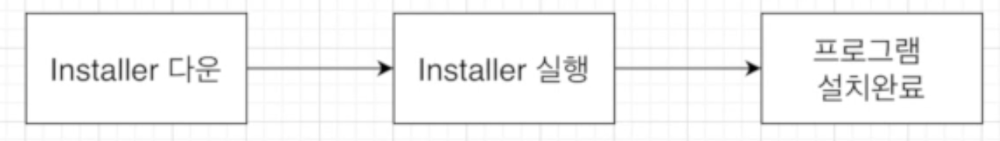
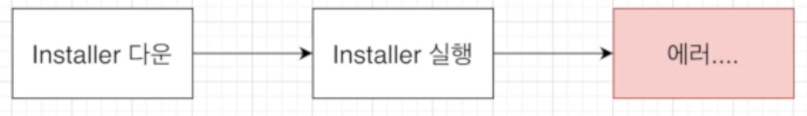
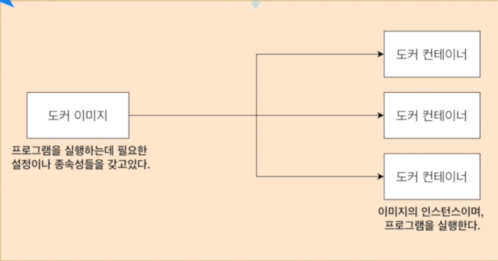
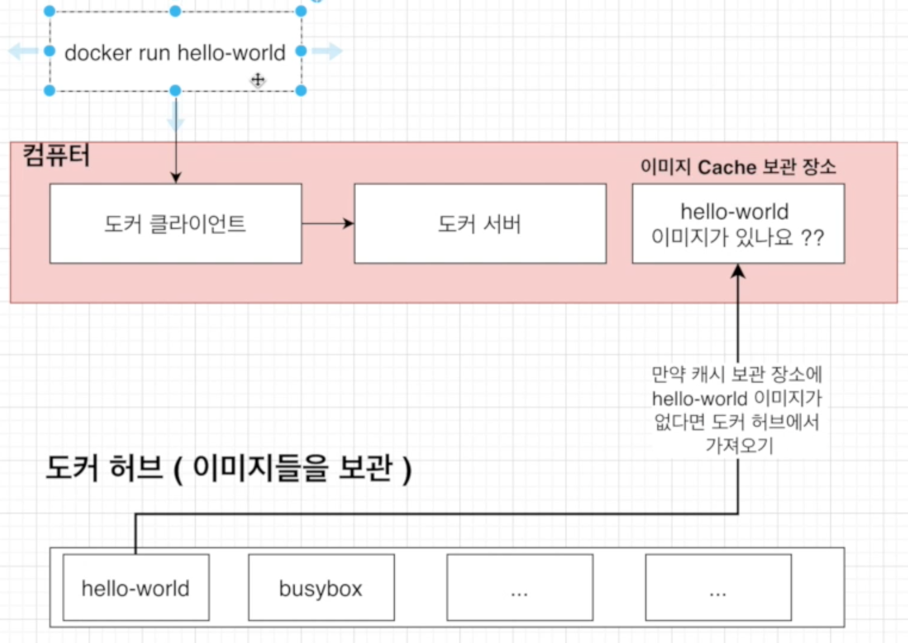
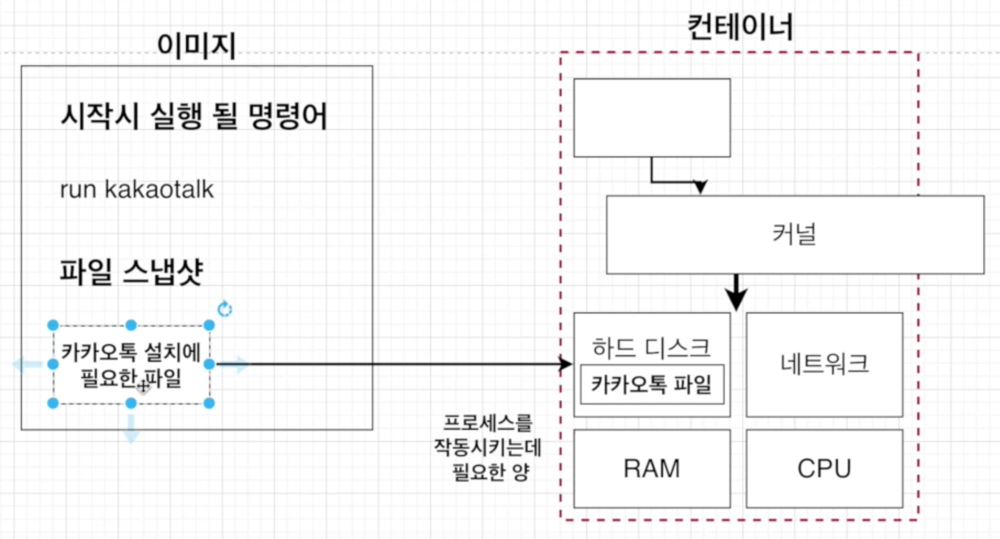
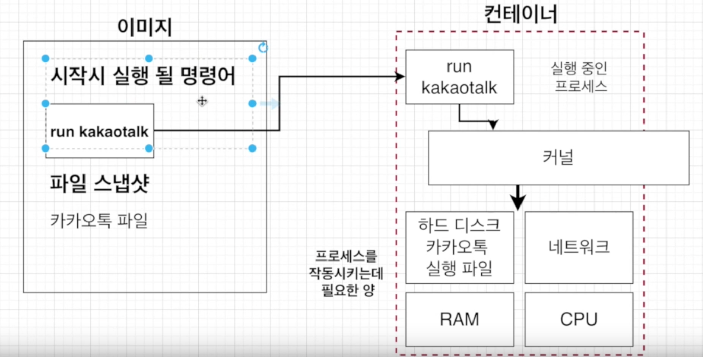
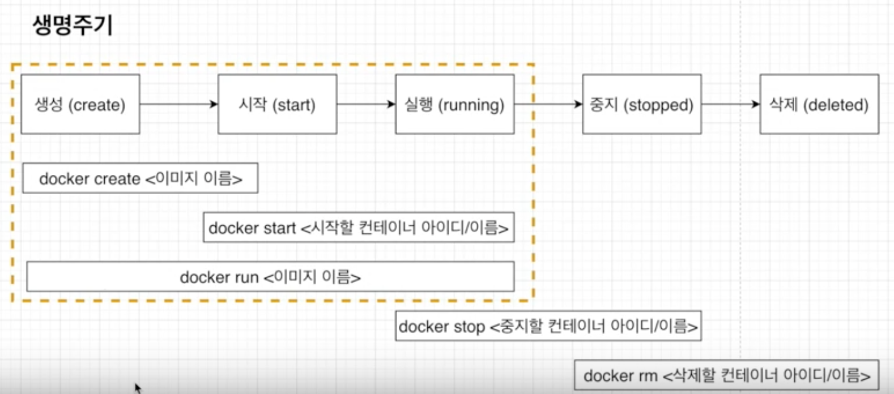

# Docker Basic

## 도커는 왜 사용되는가?

우선 결론부터 말하면 어떤 프로그램을 다운 받는 과정을 간단하게 만들기 위해서입니다.

도커 없이 프로그램을 받을때 원래 프로그램을 받는 순서를 보자면 아래 이미지와 같이  
  

카카오톡을 예로들면 카카오톡 installer를 다운로드 받고 installer을 실행하고 설치를 완료하게됩니다.  

그러나 간혹 아래와 같이  

  
installer을 다운로드하고 실행하는 가운데 에러가 나는 경우가 있습니다.  

그 이유는 installer는 많은 것에 영향을 받게되는데  
예를들어 갖고 있는 서버, 패키지 버전, 운영체제 등에 따라 프로그램을 설치하는 과정중에 에러가 발생되게됩니다.  

그래서 이러한 설치 과정의 복잡함을 단순하게 만들수 있는 것이 Docker입니다.  

## 도커란 무엇인가?

컨테이너를 사용하여 응용프로그램을 더 쉽게 만들고 배포하고 실행할 수 있도록  
설계된 도구이며 컨테이너 기반의 오픈소스 가상화 플랫폼입니다.  

### 컨테이너란?

일반적인 컨테이너의 개념은 택배를 배송하거나 화물들을 담는 공간을 컨테이너라고 합니다.  

그렇다면 서버에서의 컨테이너 개념은 어떤 것일까요?  

### 서버에서의 컨테이너 개념  

&nbsp;
  

서버에서의 컨테이너는 위의 이미지와 같이 어떤 컨테이너 안에 다양한 프로그램, 실행환경들  
(예를들어 위의 이미지에서는 radis, webpack, mysql)을 컨테이너라는 공간에 추상화하고  
동일한 인터페이스를 제공하여 프로그램의 이동, 배포 관리를 단순하게 만들어주는 개념입니다.  

이는 AWS, Azure, Google cloud 등 어디에서든 실행 가능하게 해줍니다.  

## Docker Image와 Container의 정의

### Docker Container

컨테이너는 코드와 모든 Dependencies를 패키지화하여 응용 프로그램이 한 컴퓨팅 환경에서 다른 컴퓨팅 환경으로  
빠르고 안정적으로 실행되도록 하는 소프트웨어의 표준 단위입니다.  

### Docker Image

컨테이너 이미지는 코드, 런타임, 시스템 도구, 시스템 라이브러리 및 설정과 같은 응용 프로그램을 실행하는데  
필요한 모든 것을 포함하는 가볍고 독립적이며 실행 가능한 소프트웨어 패키지입니다.  

  

왼쪽에 보이는 도커 이미지를 이용해서 오른쪽의 도커 컨테이너들을 생성하게 되는데요.  
왼쪽의 도커 이미지는 응용 프로그램을 실행하는데 필요한 모든 것을 포함하고 있습니다.  

예를들어 카카오톡을 실행한다고 하면 카카오톡의 설정과 모든 종속성을 도커 이미지가 갖고 있는 것입니다.  

그리고 그 이미지들을 이용해서 컨테이너를 만들고 그 컨테이너를 실행을 하면  
컨테이너 안에서 어플리케이션이 돌아가는 것입니다.  

이렇게 이미지를 이용해서 만들어진 컨테이너를 이미지의 인스턴스라고 합니다.  

또한 컨테이너 이미지는 런타임에 컨테이너가 되고 도커 컨테이너의 경우  
도커 엔진에서 실행될 때 이미지 컨테이너가 됩니다.  

### 정리

- 도커 이미지는 프로그램을 실행하는데 필요한 설정이나 종속성을 갖고 있다.
- 도커 이미지를 이용해서 컨테이너를 생성하며, 도커 컨테이너를 이용하여 프로그램을 실행한다.

## 도커의 실행 흐름

도커를 사용할 때는 아래와 같이 사용합니다.  

1. 먼저 도커 CLI에 커맨드를 입력합니다.
2. 그러면 도커 서버(도커 Daemon)가 그 커맨드를 받아서  
그것에 따라 이미지를 생성하든 컨테이너를 실행하든 모든 작업을 하게됩니다.

좀더 상세하게 설명드리겠습니다.  

  

1. 먼저 `docker run hello-world`를 커맨드를 입력합니다. 이렇게하면 도커 클라이언트에 입력을 한 것입니다.
2. 클라이언트에 입력한 커맨드는 도커 서버에 전달이 됩니다.
3. 도커 서버에 전달된 `hello-world` 이미지가 있는지 이미지 자신의 컴퓨터 Cache 보관 장소에서 확인합니다.
4. 만약 자신의 컴퓨터 이미지 Cache 보관 장소에 이미지가 없다면, 도커 허브에서 가져오게됩니다.

## 이미지로 컨테이너 만들기

도커 이미지는 응용 프로그램을 실행하는데 필요한 설정과 종속성들을 가지고 있다고 했습니다.  
그렇다면 그 설정과 종속성을 어떤것을 의미하는 걸까요?  

### 설정과 종속성?

첫번째는 컨테니어가 시작될 때 실행되는 명령어입니다.  
예를 들자면 컨테이너를 시작할때 사용하는 `run`과 같은 명령어죠.  

두번째는 파일 스냅샷입니다. 이는 디렉토리나 파일을 카피한 것을 의미합니다.  
예를들어 컨테이너에서 카카오톡을 실행하고 싶으면 카카오톡 파일(카카오톡을 실행하는데 필요한 파일들)의 스냅샷을 의미합니다.  

### 이미지로 컨테이너를 만드는 순서

1. Docker 클라이언트에 `docker run <이미지명>` 을 입력해줍니다.
2. 도커 이미지에 있는 파일 스냅샷을 컨테이너 하드 디스크에 옮겨줍니다.

  

위의 이미지를 보면, 

- 도커 이미지는 `run kakaotalk`이라는 커맨드를 가지고 있고 카카오톡 설치에 필요한 파일을 가지고 있습니다.  
- `docker run kakaotalk`라는 커맨드를 입력했다고 가정했을때,  
파일 스냅샷의 카카오톡 설치에 필요한 파일을 컨테이너 안의 하드 디스크 부분에 파일을 넣어줍니다.  
 
3. 그 후 시작시 실행될 명령어인 `run kakaotalk`을 아래 이미지와 같이

  

컨테이너에 명령어를 넣어주면 컨테이너가 실행이 될 때 커널을 통해서  
카카오톡 실행파일을 실행해서 컨테이너 안에서 카카오톡이 실행되는 것입니다.

## 기본적인 도커 클라이언트 명령어

### 이미지 내부 파일 시스템 구조 보기

명령어는 `docker run <이미지이름> ls`입니다.  

이 명령어를 사용하면 도커 파일의 시스템 구조를 알 수 있습니다.  

```
% docker run composetest_web ls

Dockerfile
app.py
docker-compose.yml
requirements.txt
```

### 컨테이너들 나열하기

명령어는 `docker ps`입니다.  

이 명령어를 사용하면 실행되고 있는 컨테이너들을 보여줍니다.  

```
% docker ps

CONTAINER ID        IMAGE               COMMAND                  CREATED             STATUS              PORTS                               NAMES
1679d08cb528        mysql:5.7           "docker-entrypoint.s…"   3 days ago          Up 3 days           0.0.0.0:3306->3306/tcp, 33060/tcp   realtalks_db_1
```

각 컬럼의 의미는  

1. CONTAINER ID: 컨테이너의 고유한 아이디 해쉬값으로 실제로는 더욱 길지만 일부분만 표출합니다.
2. IMAGE: 컨테이너 생성 시 사용한 도커 이미지 입니다.
3. COMMAND: 컨테이너 시작시 실행된 명령어로 대부분 이미지에 내장되어 있으므로 별도 설정이 필요 없습니다.
4. CREATED: 컨테이너가 생성된 시간을 의미합니다.
5. STATUS: 컨테이너의 상태를 의미하는 것으로, 실행중은 Up, 종료는 Exited, 일시정지는 Pause로 표현합니다.
6. PORTS: 컨테이너가 개방한 포트와 호스트에 연결한 포트를 의미합니다.  
특별한 설정을 하지 않은 경우 출력되지 않습니다.
7. NAMES: 컨테이너의 고유한 이름을 나타냅니다.  
만약 컨테이너 생성 시에 `--name` 옵션으로 이름을 설정하지 않으면  
도커 엔진이 임의로 형용사와 명사를 조합해 설정합니다.  
id와 마찬가지로 중복이 안되고 `docker rename` 명령어로 이름을 변경할 수 있습니다.  
ex) `docker rename original-name changed-name`

#### 원하는 항목만 보고 싶다면?

명령어는 docker ps --format 'table{{Names}}\table{{Image}}'입니다.

#### 만약 실행되지 않은 컨테이너까지 전부 보고싶다면?

명령어는 `docker ps -a`입니다.

## 도커 컨테이너의 생명주기

  

생명주기는 도커의 생성부터 삭제까지가 도커의 생명주기 입니다.  

### docker run
우리가 도커를 실행할 때 사용했던 `docker run <이미지 이름>`은  
사실 두가지의 커맨드로 이루어져 있는데요. 

`Docker create <이미지 이름>` + `Docker start <컨테이너 아이디/이름>`으로 이루어져 있습니다.  

이것이 의미하는 바는 `docker run <이미지 이름>`은  
도커의 생성과 시작을 한다음 실행한다는 의미를 가지게 됩니다.  

### docker stop & docker kill

실행중인 컨테이너를 멈추는 커맨드로 명령어는 `docker stop <이미지 이름>`입니다.  

`docker stop`은 실행되고 있는 컨테이너가 바로 정지되는 것이 아니고 일정 시간 더 작동하다가 멈춥니다.  

반면 `docker kill <이미지 이름>`은 실행중인 컨테이너가 커맨드를 입력한 순간 멈추게 됩니다.

  

위의 이미지를 참고해서 설명해보면,  
`docker stop`은 `Sigterm`이라는 것을 날려서 `Grace period`(정리하는 시간)을 준다음 `SigKill`이라는 것을 `Main Process`에 날려서 컨테이너가 정지되는 것이고,  

`docker kill`은 정리하는 시간을 안주고 바로 컨테이너를 정지 시키는 것입니다.  
