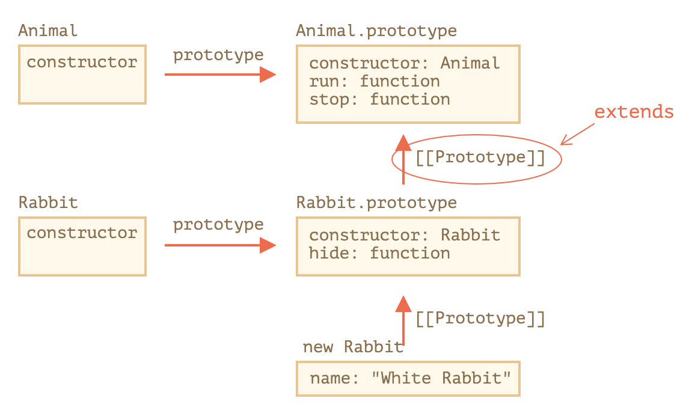

## 클래스 생성

클래스는 객체 지향 프로그래밍에서 특정 객체를 생성하기 위해 변수와 메소드를 정의하는 일종의 틀로,  
객체를 정의하기 위한 상태(멤버 변수)와 메서드(함수)로 구성됩니다.  

```js
class User {
    constructor(name) {
        this.name = name;
    }

    sayHi() {
        alert("Hi!!!");
    }
}

const john = new User("John");

john.sayHi();
```

class는 `new`라는 명령어에 의해 객체가 생성되게 됩니다.  
&nbsp;  
위처럼 `new User("John")` 처럼 객체가 생성될 때, `constructor()` 메서드가 호출되는데  
이것을 `생성자`라고 합니다.  
&nbsp;  
위의 예제에서 `constructor`가 호출될때 `name`이라는 `argument`를 넘겨받는데  
이때 `name`은 `this.name`에 할당되게 됩니다.  
이를 간단하게 이야기하면 위에서 생성된 객체는 `John`이라는 이름을 가진 사람이고 동시에 `sayHi()`라는  
말을 할수 있는(기능을 가진) 사람(객체)이 생긴 것 이라고 생각하면됩니다.

## getter, setter

getter와 setter는 말 그대로 어떤 객체의 값을 가져오거나, 설정해주는 역할을 하는 메소드를 말합니다.

```ts

// getter setter
export class User {
    private _name: string;

    constructor(name:string) {
        this._name = name;
    }

    // getter는 객체의 변수의 정보를 가져올때 사용
    get name(): string {
        return this._name
    }

    // setter는 객체의 변수에 값을 세팅할 때 사용
    set name(value) {
        console.log('호출')
        this._name = value
    }
}

const user = new User("John");

console.log(user.name); // getter로 John이라는 이름을 가져옴

new User("man"); // man이라는 name을 가진 객체 생성

user.name = "fe";  // setter로 기존에 John이었던 이름을 fe로 바꿈
```

## 클래스의 상속

### 상속이란?

상속은 부모 클래스의 필드/메소드를 자식 클래스가 물려받아 그대로 사용 가능하게 해주는 것입니다.  
&nbsp;  
여기서 부모클래스를 superclass, 자식클래스를 subclass라 부릅니다.  
&nbsp;  
자식클래스에서 A라는 기능을 처리하는데 부모클래스에서 이미 똑같은 A라는 기능을 처리하고 있다면  
자식클래스는 이를 상속받아 그대로 사용할 수 있으며, 코드의 중복을 막아주게 됩니다.  
&nbsp;  
아래의 예제를 토대로 상속이 어떻게 이루어지는지 확인해봅니다.

```ts
export class Animal {
    speed: number;
    name: string;

    constructor(name:string) {
        this.name = name;
        this.speed = 0;
    }

    run(speed: number) {
        this.speed = speed;
        console.log(`${this.name}은/는 속도 ${this.speed}로 달립니다.`);
    }

    stop() {
        this.speed = 0;
        console.log(`${this.name}이/가 멈췄습니다.`);
    }
}

export class Rabbit extends Animal {
    hide() {
        console.log(`${this.name}이/가 숨었습니다!`)
    }
}
```

위의 구조는 동물의 특성을 토끼한테 상속해주는 내용입니다.  
그렇다면 상속이 이루어짐으로서 어떤 효과를 보게될까요?  
&nbsp;  
  

기존에 `Rabbit` 클래스는 `hide()`아는 메서드만 있지만 `Animal`을 상속받아  
`Animal`에 있는 메서드, 필드들을 사용할 수 있게됩니다. 아래와 같이 말이죠.  

```ts
const rabbit = new Rabbit("Tomas");

// 기존에 Rabbit 객체가 사용할 수 있는 메서드
rabbit.hide() // Tomas이/가 숨었습니다!

// Rabbit 객체가 Animal 객체를 상속받아 Animal 객체의 변수, 메서드를 활용하는 부문
console.log(rabbit.name) // Tomas
rabbit.run(100) // Tomas은/는 속도 100로 달립니다.
console.log(rabbit.speed) // 100
rabbit.stop() // Tomas이/가 멈췄습니다.
```

### 메서드 오버라이드

오버라이드는 상속받은 메서드를 자식 클래스에서 재구성해서 사용하는 것입니다.  
오버라이드된 메서드를 호출하면 부모 클래스의 메서드 기준이 아닌 오버라이드해서  
재구성한 자식 메서드 기준의 코드가 작동되게 됩니다.  
&nbsp;  
부모 클래스의 `stop()`메서드를 자식 클래스에서 오버라이드하여 재구성하여 사용해보겠습니다.

```ts
export class Rabbit extends Animal {
    hide() {
        console.log(`${this.name}이/가 숨었습니다!`)
    }

    // 오버라이드 
    stop() {
        console.log('오버라이드 된 메서드');
        super.stop();
        this.hide();
    }
}

const rabbit = new Rabbit("Tomas");

rabbit.stop()
/*
결과 

오버라이드 된 메서드
Tomas이/가 멈췄습니다.
Tomas이/가 숨었습니다!
*/
```

위와 같이 오버라이드된 메서드가 실행되었습니다.  

#### 생성자 오버라이드

```ts
export class Cat extends Animal {
    sound: String;

    constructor(name: string) {
        super(name);
        this.sound = "Meow";
    }
}
```

만약 생성자를 오버라이드 한다면 `super()`로 가져와야합니다.  
&nbsp;  
상속 클래스의 생성자에선 super를 호출해 부모 생성자를 실행해 주어야 합니다.  
그렇지 않으면 this가 될 객체가 만들어지지 않아 에러가 발생합니다.  
