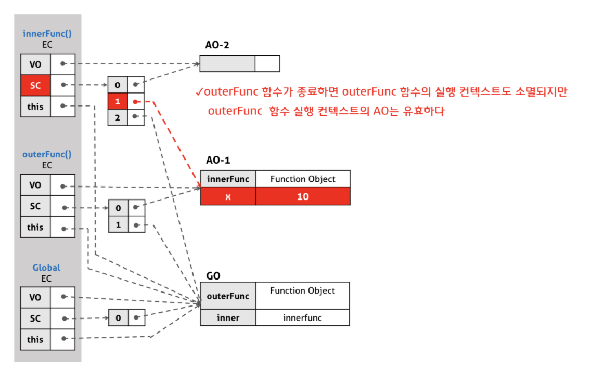

## 클로저란?
 클로저는 자신이 생성될 때의 환경(Lexical environment)을 기억하는 함수로  
 클로저는 반환된 내부함수가 자신이 선언됐을 때의 환경(Lexical environment)인 스코프를 기억하여  
 자신이 선언됐을 때의 환경(스코프) 밖에서 호출되어도 그 환경(스코프)에 접근할 수 있는 함수를 말합니다.   

### 실행컨텍스트 관점

```js
function outerFunc() {
  var x = 10;
  var innerFunc = function () { console.log(x); };
  return innerFunc;
}

/**
 *  함수 outerFunc를 호출하면 내부 함수 innerFunc가 반환된다.
 *  그리고 함수 outerFunc의 실행 컨텍스트는 소멸한다.
 */
var inner = outerFunc();
inner(); // 10
```
위의 코드를 예로 들어 설명드리겠습니다.  

  

실행 컨텍스트의 관점에 설명하면, 내부함수(innerFunc)가 유효한 상태에서 외부함수(outerFunc)가 종료하여  
외부함수(outerFunc)의 실행 컨텍스트가 반환(실행 컨텍스트에서 나가도)되어도,  
외부함수(outerFunc)가 내부함수(innerFunc)에 의해 참조(스코프 체인에 의해)되고  
외부함수 내의 변수는 이를 필요로 하는 내부함수가 하나 이상 존재하는 경우  
활성 객체(Activation object)(활성 객체의 변수, 함수 선언 등의 정보)는 계속 유지 되고  
내부함수가 스코프 체인을 통해 참조될 수 있는 것을 의미합니다.  

### 클로저의 활용

```html
<!DOCTYPE html>
<html>
<body>
  <button class="toggle">toggle</button>
  <div class="box" style="width: 100px; height: 100px; background: red;"></div>

  <script>
    var box = document.querySelector('.box');
    var toggleBtn = document.querySelector('.toggle');

    var toggle = (function () {
      var isShow = false;

      // ① 클로저를 반환
      return function () {
        box.style.display = isShow ? 'block' : 'none';
        // ③ 상태 변경
        isShow = !isShow;
      };
    })();

    // ② 이벤트 프로퍼티에 클로저를 할당
    toggleBtn.onclick = toggle;
  </script>
</body>
</html>
```

위의 코드는 div 박스와 버튼이 있을때,  
버튼을 누르면 박스가 표시되고 숨김 처리되게 하는 토글 동작을 하는 코드입니다.  

1. 위의 코드에서 toggle에 할당된 즉시 실행 함수는 함수를 반환하고 소멸합니다.  
즉시실행함수가 반환한 함수는 자신이 생성됐을 때의 선언되었을 때의 환경에 속한 변수 isShow를 기억하는 클로저입니다.  
클로저의 변수 isShow는 box 요소의 표시 상태를 나타냅니다.  

2. toggleBtn에 클로저를 onclick 이벤트 핸들러로 할당했습니다.  
이벤트 프로퍼티에서 이벤트 핸들러인 클로저를 제거하지 않는 한  
클로저가 기억하는 렉시컬 환경의 변수 isShow는 소멸하지 않습니다.  
다시 말해 현재 상태인 isShow를 기억합니다.  

3. 버튼을 클릭하면 이벤트 프로퍼티에 할당한 이벤트 핸들러인 클로저가 호출됩니다.  
이때 .box 요소의 표시 상태를 나타내는 변수 isShow의 값이 변경됩니다.  
변수 isShow는 클로저에 의해 참조되고 있기 때문에 유효하며 자신의 변경된 최신 상태를 계속해서 유지합니다.  
  
4. 이처럼 클로저는 현재 상태(위의 코드에선 isShow)를 기억하고 이 상태가 변경되어도 최신 상태를 유지해야하는 상황에 유용합니다.  
클로저를 안써도 상태 유지를 위해 전역 변수를 사용해도 되지 않나 라는 의문이 들 수도 있지만,  
변수의 값은 누군가에 의해 언제든지 변경될 수 있어 오류 발생의 근본적 원인이 될 수 있습니다.  
상태 변경이나 가변(mutable) 데이터를 피하고 불변성(Immutability)을 지향하는 함수형 프로그래밍에서  
부수 효과(Side effect)를 최대한 억제하여 오류를 피하고 프로그램의 안정성을 높이기 위해 클로저가 사용됩니다.  
 


