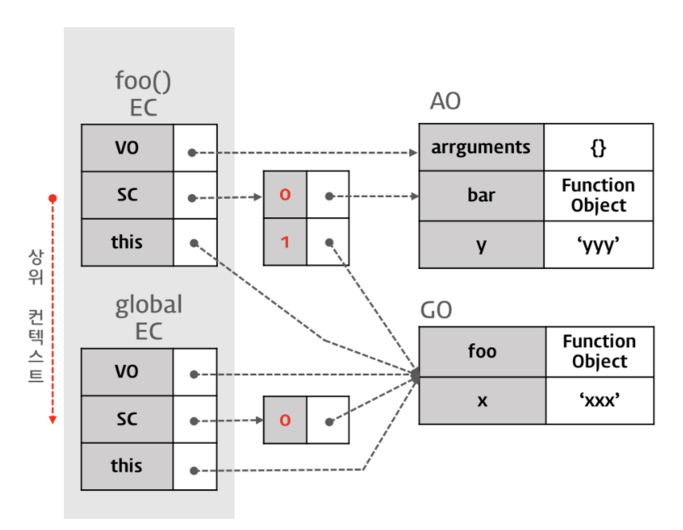
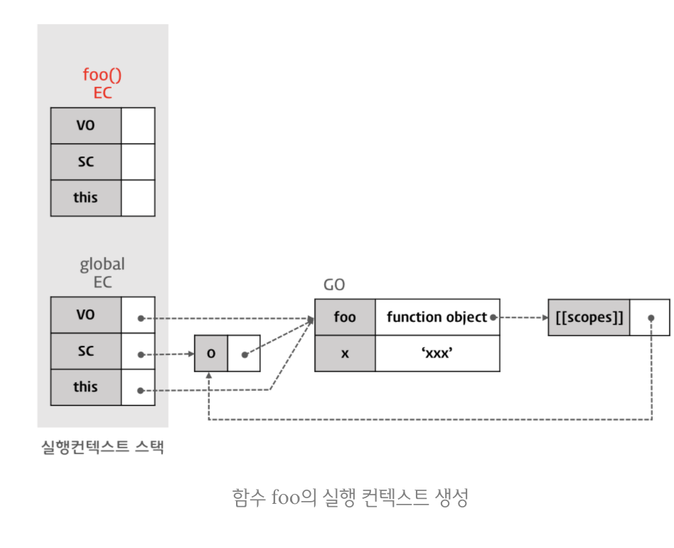

## 실행 컨텍스트란?
실행 컨텍스트는 실행 가능한 코드가 실행되기 위해 필요한 환경이라고 할 수 있는데,  
여기서 실행 가능한 코드는 전역 영역에 존재하는 코드와 함수내에 존재하는 코드와 Eval 코드(추후에 공부) 입니다.

## 자바스크립트 엔진이 코드를 실행하기 위해 필요한 정보

- 변수 : 전역변수, 지역변수, 매개변수, 객체의 프로퍼티
- 함수 선언
- 변수의 유효범위(Scope)
- this

## 실행 컨텍스트의 구조

### Variable Object (VO / 변수객체)

실행 컨텍스트가 생성되면 자바스크립트 엔진은 실행에 필요한 여러 정보들을 담을 객체를 생성하는데 그것이 Variable Object입니다.  
* VO에는 아래의 정보들을 담습니다.
    - 변수
    - 매개변수(parameter)와 인수 정보(arguments)
    - 함수 선언(함수 표현식은 제외)
* 전역 컨텍스트(Global Context)에서 VO가 가리키는 객체
  
전역 컨텍스트에서 VO는 전역에 선언된 전역변수와 전역함수를 프로퍼티로 소유한 전역객체(Global Object)를 가리킵니다.

* 함수 컨텍스트에서 VO가 가리키는 객체
  
함수 컨텍스트에서 VO는 지역변수와 내부함수, 그리고  매개변수와 인수들의 정보를 배열의 형태로 담고 있는 객체인 argument object를  
프로퍼티로 가진 활성 객체(Activation Object)를 가리킵니다.

### Scope Chain (SC)

스코프 체인(Scope Chain)은 일종의 리스트로서 전역 객체와 중첩된 함수의 스코프의 레퍼런스(주소값)를 차례로 저장하고 있습니다.  
  
여기서 리스트는 링크드리스트와 비슷한 걸로 이해했습니다.  
링크드리스트는 아무 공간에나 저장해둔 데이터를 포인터로 연결하는 구조인데  
노드(데이터 값과포인터(주소값)로 구성)와 노드가 연결되는 구조입니다.  
  
여기서 스코프 체인은 이미지를 예를들면 현재 실행 컨텍스트에서 활성객체인 foo()


### this value

this 프로퍼티에는 this에 할당되는 값은 함수 호출 패턴에 의해 결정된다.

## 코드로 실행 컨텍스트를 이해

```js
var x = 'xxx';

function foo () {
  var y = 'yyy';

}
foo();
```
### 1. 전역코드 진입

  
엔진이 실행 가능한 코드에 진입하게되면 `실행 컨텍스트 스택`이 생성됩니다.  
`스택`은 `LIFO(후입선출) 방식`으로 `마지막에 들어온것이 먼저 나가는 구조`입니다.  
  
전역코드에 진입하면서 `전역 객체(Global Object)`가 생성됩니다.  
이때 생성된 `전역 객체`에는 초기 상태로 빌트인 객체(Math, String, Array 등)와 BOM(Browser Object Model), DOM(Document Object) 등이 설정되어있습니다.  
  
이후 `전역 실행 컨텍스트`가 생성되고 이 컨텍스트가 `실행 컨텍스트 스택`에 쌓입니다.  
  
### 2. 스코프 체인의 초기화

  
실행 컨텍스트 생성 이후 스코프 체인의 스코프 체인의 생성과 초기화가 실행되는데,  
이떄 스코프체인은 전역객체의 주소를 포함하는 리스트로 생성됩니다.  

### 3. Variable Instantiation(변수 객체화) 실행

다음은 변수 객체화가 실행됩니다.  
변수 객체화는 실행 컨텍스트의 Value Object에 프로퍼티와 값을 추가하는 것입니다.  
parameter, argument, 함수 선언을 Value Object에 프로퍼티와 값을 set하는데 순서는 아래와 같습니다.  
1. 함수의 경우 parameter가 Variable Object의 프로퍼티로, argument가 값으로 설정된다.
2. 대상 코드 내의 함수 선언을 대상으로 함수명이 Variable Object의 프로퍼티로, 생성된 함수 객체가 값으로 설정된다.(함수 호이스팅)
3. 대상 코드 내의 변수 선언을 대상으로 변수명이 Variable Object의 프로퍼티로, undefined가 값으로 설정된다.(변수 호이스팅)
  
위의 코드에서는 foo함수가 먼저 선언 처리되고 변수 x선언이 처리됩니다.  
  
### 4. 함수 foo의 선언 처리
  
 
  
위에서 설명했듯이, 함수명이 Variable Object의 프로퍼티로, 함수 객체가 값으로 설정됩니다.  
이때 생성된 함수 객체는 `[[Scopes]]` 프로퍼티를 가지게되는데,  
여기서 `Scope`는 함수객체가 소유하는 내부 프로퍼티로  함수 객체가 실행되는 환경을 의미합니다.  
`Scope`는 프로퍼티는 자신의 실행 환경과 자신을 포함하는 외부 함수의 실행 환경과 전역 객체를 가리키게 됩니다.  
  
여기까지는 코드가 실행되기 전인데, 여기서 알 수 있는 점은 `함수 표현식`의의 경우는  
`일반 변수 선언 방식`을 따르기 때문에 `함수 표현식 선언 이후`에 `함수 호출`이가능하지만,  
`함수 선언식`의 경우 먼저 `Variable Object에 함수명을 프로퍼티로 즉시 함수객체를 할당`하기 때문에 `선언문 이전`에 `함수를 호출`할 수 있게됩니다.  
이러한 현상을 `함수 호이스팅`이라고 합니다.  

### 5. 변수 x의 선언처리

위에서 설명했듯이 변수명이 Variable Object의 프로퍼티로 들어가고 undefined로 초기화 됩니다.  
이걸 순서로 정리하면 아래와 같습니다.  
- 선언 단계
Variable Object에 변수를 등록하는데 이 변수 객체는 스코프가 참조할 수 있는 대상입니다

- 초기화 단계
Variable Object에 등록된 변수를 메모리에 할당한다. 이 단계에서 변수는 undefined로 초기화됩니다.

- 할당 단계
undefined로 초기화된 변수에 실제값을 할당합니다.

#### var 변수 선언

 

`var` 키워드로 선언된 변수는 `선언 단계와 초기화 단계가 한번에` 이루어집니다.  
따라서 `변수 선언 이전에 변수에 접근`해도 Variable Object에 변수가 존재하기 때문에 `에러가 발생하지 않습니다`.  
`변수 선언이전에 접근`하게되면 초기값인 `undefined를 반환`하게되는데 이런현상을 `변수 호이스팅`이라고합니다.  
아직 변수 할당문에 도달하지 않았기 때문에 현재 값은 `undefined`입니다.  

### this value 결정

 

변수 선언 처리가 끝난 후 this value가 결정되는데, 기본적으로 this value 결정 이전에는 this는 전역객체를 가리키게되고,  
함수 호출 패턴에 따라 this value가 달라집니다.  
전역 컨텍스트(전역 코드)의 경우, Variable Object, 스코프 체인, this 값은 언제나 전역 객체를 가리킵니다.  

### 변수 값의 할당

 

전역 변수 x에 문자열 ‘xxx’를 할당할 때, 현재 실행 컨텍스트의 스코프 체인이 참조하고 있는  
Variable Object의 선두(전역객체의 맨위)부터 검색하게되는데,  
변수명에 맞는 프로퍼티가 발견되면 값 'xxx'를 할당합니다.  

### 함수 foo의 실행

 

함수가 실행되면 foo 함수에 대한 함수 실행 컨텍스트가 실행됩니다.  
1. 스코프 체인의 생성과 초기화
2. Variable Instantiation 
3. this value 결정
순으로 전역코드와 비슷하게 실행되는데 this value 결정은 함수 호출패턴에 따라 달라집니다.  
