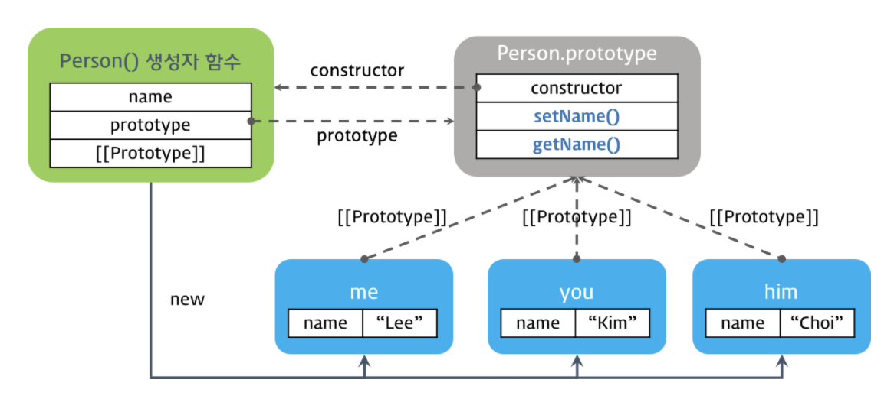

## 객체 지향 프로그래밍이란?

객체 지향은 우리 주변의 사물을 인지하는 방식을 프로그래밍에 접목한 것으로,  
객체(Object)를 핵심적인 개념과 기능만을 추출하는 추상화(abstraction)를 통해 모델링하려는 프로그래밍 패러다임을 말합니다.  

실생활에서 예를들면 컴퓨터가 있을때 각각의 부품들을 객체라고 생각하고 각 부품마다 기능들을 따로따로 가지고 있는 것을 생각할 수 있습니다.

### 객체 지향 프로그래밍의 장점?

- 코드 재사용에 용이: 다른 클래스의 기능들을 상속해서 확장해서 사용하는 등 재 사용할 수 있습니다.

- 유지보수가 쉬움: 어느 한부분의 기능에 문제가 있을 때 일일히 모든 코드를 찾을 필요없이 해당 클래스를 찾아가서 그 기능 부분만 수정하면됩니다.

### 프로토타입 기반 객체지향 언어

자바스크립트는 프로토타입 기반 객체지향 언어입니다.  

자바스크립트에는 객체를 생성하는 방법은 아래와 같이 3가지가 있습니다.  

```js
// 객체 리터럴
var obj1 = {};
obj1.name = 'Lee';

// Object() 생성자 함수
var obj2 = new Object();
obj2.name = 'Lee';

// 생성자 함수
function F() {}
var obj3 = new F();
obj3.name = 'Lee';
```

자바스크립트는 이미 생성된 인스턴스의 자료구조와 기능을 동적으로 변경할 수 있는 특징이 있습니다.  
객체지향의 상속과 캡슐화 개념은 프로토타입 체인과 클로저로 구현할 수 있는데, ECMAScript 6에서 클래스가 도입되면서  
클래스 기반 언어의 문법과 같이 구현이 가능하게 되었습니다.  

## 생성자 함수와 인스턴스의 생성

자바스크립트는 생성자 함수와 new 연산자를 통해 인스턴스를 생성할 수 있습니다.  
이때 생성자 함수는 클래스이자 생성자 역할을 합니다.  

```js

// 생성자 함수 (Constructor)
function Person(name) {
    // 프로퍼티
    this.name = name;

    // 메서드
    this.setName(name) {
        this.name = name;
    }
    this.getName() {
        return this.name;
    }
}


const me = new Person("Jack");
console.log(me.getName());// Jack

me.setName("Hal");
console.log(me.getName());// Hal

```
근데 위와 같이 인스턴스를 생성해버리면 각각의 인스턴스에 메서드 setName, getName이 중복되어 생성됩니다.  
이는 메서드가 많아질 수록 메모리 낭비가 더욱 심해진다는 이야기가됩니다.
```js
var me  = new Person('Lee');
var you = new Person('Kim');
var him = new Person('Choi');

console.log(me);  // Person { name: 'Lee', setName: [Function], getName: [Function] }
console.log(you); // Person { name: 'Kim', setName: [Function], getName: [Function] }
console.log(him); // Person { name: 'Choi', setName: [Function], getName: [Function] }
```

## 프로토타입 체인과 메소드의 정의

위의 문제를 해결할 방법이 프로토타입입니다.  
프로토타입은 다른 객체를 가리키는 내부 링크를 가지고 있어  
프로토타입을 통해 직접 객체를 연결할 수 있는데 이를 프로토타입 체인이라고합니다.  

```js
function Person(name) {
  this.name = name;
}

// 프로토타입 객체에 메소드 정의
Person.prototype.setName = function (name) {
  this.name = name;
};

// 프로토타입 객체에 메소드 정의
Person.prototype.getName = function () {
  return this.name;
};

var me  = new Person('Lee');
var you = new Person('Kim');
var him = new Person('choi');

console.log(Person.prototype);
// Person { setName: [Function], getName: [Function] }

console.log(me);  // Person { name: 'Lee' }
console.log(you); // Person { name: 'Kim' }
console.log(him); // Person { name: 'choi' }
```

  

위 코드는 Person 생성자 함수의 프로토타입 프로퍼티가 가리키는 프로토타입 객체에 setName, getName 메서드를 정의한  
코드입니다.  

이렇게되면 위의 그림과 같이 새로운 Person 객체가 계속 생성되었을 때 메서드까지 같이 생성되는 것이 아니고  
Person 생성자 함수의 프로토타입 프로퍼티가 가리키는 프로토타입 객체를 참고하여 setName. getName 메서드를 사용할 수 있게됩니다.

## 상속

상속이란 부모 클래스의 변수 및 메서드를 물려받아 사용가능하게 하는 것을 상속이라고합니다.  

상속을 하는 이유는 상속 받는 자식 클래스가 부모 클래스와 유사한 기능을 한다면, 이를 상속받아 코드를 재사용하고  
다른 부분만 구현하게되어 코드 재사용으로 개발 비용을 줄일 수 있는 장점이 있습니다.  

### 상속 방법

#### 프로토타입 패턴 상속 방법


```js
const el = document.getElementById("test");

const Parent = (function (){

    // 생성자 함수
    function Parent(name) {
        this.name = name
    }

    // 부모 생성자 함수에 프로토 타입에 메서드 정의
    Parent.prototype.sayHI = function(){
        return `Hi, ${this.name}`;
    }

    // 생성자 함수를 반환
    return Parent;
})();

// create 함수의 인수는 프로토타입이다.
const child = Object.create(Parent.prototype);
child.name = 'jack';

console.log(child instanceof Parent); // true

const div1 = document.createElement("div");

// 부모로 부터 상속받은 메서드 호출
div1.innerHTML = ch.sayHI();

el.appendChild(div1); // Hi, jack
```

위의 코드는 부모 생성자 함수의 프로토타입을 Object.create를 이용하여 상속하는 함수입니다.

Object.create는 기존 객체를 새로 만든 객체의 프로토타입으로 사용하여 새 객체를 만들어 반환하는 메서드입니다.

이렇게 자식 객체는 부모의 변수나 메서드들을 상속받아 사용할 수 있게됩니다.

